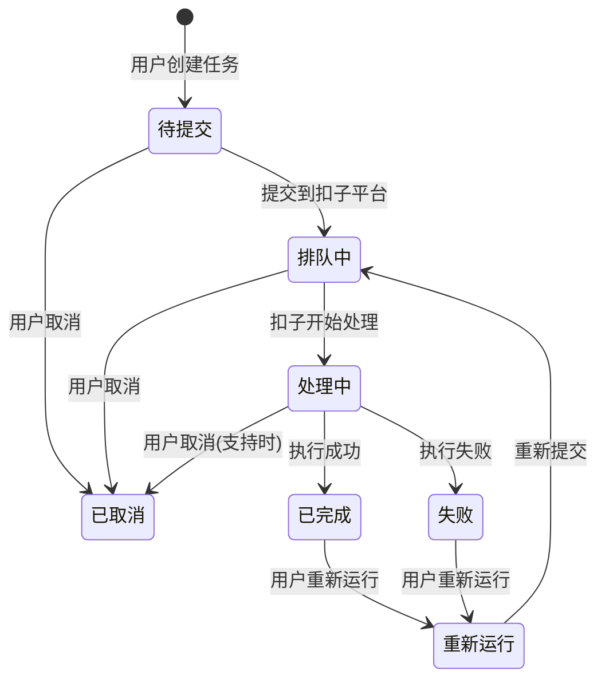

# AI工作流平台 - 任务状态同步方案

## 文档信息
- **项目名称**：AI工作流平台
- **文档类型**：状态同步技术方案
- **版本**：v1.0
- **创建日期**：2026-03-01
- **创建人**：扣子（Worker Agent）

## 1. 概述

### 1.1 背景与目标
在AI工作流平台中，用户提交的任务需要在扣子平台异步执行。为保证用户体验和数据一致性，需要设计一套高效、可靠的任务状态同步机制，实现以下目标：

1. **实时性**：用户能及时了解任务执行进度
2. **准确性**：内外系统状态保持一致
3. **可靠性**：网络波动、服务异常不影响同步
4. **可扩展性**：支持高并发任务状态同步

### 1.2 核心挑战
1. **网络延迟**：扣子API响应时间不确定
2. **并发控制**：大量任务同时需要状态同步
3. **状态一致性**：多系统间状态映射与转换
4. **资源消耗**：轮询机制可能带来额外开销

## 2. 状态定义与映射

### 2.1 平台内部状态定义
| 状态代码 | 状态名称 | 描述 | 允许操作 |
|---------|---------|------|---------|
| `0` | 待提交 | 任务已创建，待提交到扣子平台 | 提交、取消 |
| `1` | 排队中 | 任务已提交，等待扣子平台处理 | 取消 |
| `2` | 处理中 | 任务正在扣子平台执行 | 取消（部分支持） |
| `3` | 已完成 | 任务执行成功，结果可用 | 下载、重新运行 |
| `4` | 失败 | 任务执行失败 | 重新运行、查看错误 |
| `5` | 已取消 | 用户或系统取消的任务 | - |

### 2.2 扣子平台状态映射
| 扣子状态 | 内部状态 | 说明 |
|---------|---------|------|
| `Running` | `2` (处理中) | 执行中 |
| `Success` | `3` (已完成) | 执行成功 |
| `Fail` | `4` (失败) | 执行失败 |
| 无对应 | `0` (待提交) | 未调用执行接口 |
| 无对应 | `1` (排队中) | 已提交但未开始执行 |

### 2.3 状态流转图


## 3. 同步架构设计

### 3.1 整体架构
```
┌─────────────────────────────────────────────────────────┐
│                  任务状态同步中心                         │
├─────────────┬─────────────┬─────────────────────────────┤
│  轮询调度器 │ 回调处理器  │  状态广播器                   │
│  任务分片   │ 签名验证    │  WebSocket推送                │
│  智能间隔   │ 数据校验    │  应用内通知                   │
└─────────────┴─────────────┴─────────────────────────────┘
          │             │                 │
          ▼             ▼                 ▼
┌─────────────────────────────────────────────────────────┐
│                   扣子平台API                           │
├─────────────┬─────────────┬─────────────────────────────┤
│  查询执行结果│  流式响应   │  异步执行接口                 │
│  GET /run_histories │ POST /run(stream) │ POST /run     │
└─────────────┴─────────────┴─────────────────────────────┘
```

### 3.2 核心组件说明

#### 3.2.1 轮询调度器（Polling Scheduler）
**职责**：管理轮询任务，优化查询频率

**核心功能**：
- **分片策略**：按状态、时间、优先级分片处理
- **智能间隔**：根据任务类型和历史数据动态调整间隔
- **并发控制**：限制同时查询的任务数量
- **优先级调度**：处理中的任务优先查询

#### 3.2.2 回调处理器（Callback Handler）
**职责**：接收扣子平台的异步回调通知

**核心功能**：
- **签名验证**：验证回调请求的合法性
- **数据解析**：解析回调数据，提取关键信息
- **状态更新**：根据回调数据更新任务状态
- **重试机制**：处理失败的回调请求

#### 3.2.3 状态广播器（Status Broadcaster）
**职责**：将状态变更实时推送给客户端

**核心功能**：
- **多通道推送**：支持WebSocket、应用内通知、推送服务
- **离线缓存**：为离线用户缓存状态变更
- **广播优化**：按用户、设备、网络状况优化推送策略

## 4. 同步策略设计

### 4.1 轮询机制设计

#### 4.1.1 轮询模式选择
| 模式 | 适用场景 | 优点 | 缺点 |
|------|---------|------|------|
| **固定间隔轮询** | 简单场景，任务类型单一 | 实现简单，资源可预测 | 效率低，可能空转 |
| **自适应轮询** | 多任务类型，负载变化 | 动态调整，资源优化 | 算法复杂，实现难度大 |
| **事件驱动轮询** | 低延迟要求，实时性高 | 响应快，资源利用率高 | 依赖回调机制，可靠性要求高 |

**选择方案**：混合模式（自适应轮询为主，事件驱动为辅）

#### 4.1.2 轮询频率策略
| 任务状态 | 初始间隔 | 最大间隔 | 触发条件 |
|---------|---------|---------|---------|
| **排队中** | 10秒 | 30秒 | 新任务、状态变化 |
| **处理中** | 5秒 | 15秒 | 视频/图像处理任务 |
| **已完成** | - | - | 状态变为完成时 |
| **失败** | - | - | 状态变为失败时 |

**智能间隔算法**：
```java
@Component
public class SmartPollingInterval {
    
    // 计算下一个轮询间隔
    public long calculateNextInterval(TaskStatusHistory history, 
                                      TaskType type, 
                                      int retryCount) {
        // 基础间隔
        long baseInterval = getBaseInterval(type);
        
        // 根据历史响应时间调整
        double responseFactor = calculateResponseTimeFactor(history);
        
        // 根据重试次数调整
        double retryFactor = calculateRetryFactor(retryCount);
        
        // 计算最终间隔
        long interval = (long) (baseInterval * responseFactor * retryFactor);
        
        // 限制在合理范围内
        return Math.max(MIN_INTERVAL, Math.min(interval, MAX_INTERVAL));
    }
    
    private long getBaseInterval(TaskType type) {
        switch (type) {
            case VIDEO_GENERATION:
                return 5000; // 5秒
            case IMAGE_PROCESSING:
                return 3000; // 3秒
            case TEXT_GENERATION:
                return 10000; // 10秒
            default:
                return 8000; // 8秒
        }
    }
}
```

### 4.2 回调机制设计

#### 4.2.1 回调流程
```
扣子平台完成任务执行
    ↓
发送HTTP POST回调通知
    ↓
平台回调验证（签名+时间戳）
    ↓
解析回调数据，更新任务状态
    ↓
返回200 OK确认接收
    ↓
广播状态变更通知
```

#### 4.2.2 回调安全设计
1. **签名验证**：HMAC-SHA256签名算法
2. **时间戳验证**：防重放攻击（5分钟窗口）
3. **IP白名单**：仅接受扣子平台IP段
4. **频率限制**：防止恶意回调

```java
@Component
public class CallbackSecurityValidator {
    
    private static final String SECRET_KEY = System.getenv("CALLBACK_SECRET");
    private static final long MAX_TIMESTAMP_DIFF = 5 * 60 * 1000; // 5分钟
    
    public boolean validateCallback(HttpServletRequest request, 
                                    String body) {
        // 1. 验证签名
        String signature = request.getHeader("X-Coze-Signature");
        String timestamp = request.getHeader("X-Coze-Timestamp");
        
        if (!validateSignature(signature, timestamp, body)) {
            return false;
        }
        
        // 2. 验证时间戳
        if (!validateTimestamp(timestamp)) {
            return false;
        }
        
        // 3. 验证IP（可选）
        if (!validateIp(request.getRemoteAddr())) {
            return false;
        }
        
        return true;
    }
    
    private boolean validateSignature(String signature, 
                                      String timestamp, 
                                      String body) {
        String data = timestamp + "." + body;
        String expected = HmacUtils.hmacSha256Hex(SECRET_KEY, data);
        return expected.equals(signature);
    }
}
```

### 4.3 混合同步策略

#### 4.3.1 策略选择逻辑
```java
@Component
public class SyncStrategySelector {
    
    public SyncStrategy selectStrategy(Task task) {
        // 根据任务类型选择策略
        switch (task.getType()) {
            case VIDEO_GENERATION:
                // 视频任务使用回调为主，轮询为辅
                return SyncStrategy.builder()
                    .primaryMode(SyncMode.CALLBACK)
                    .fallbackMode(SyncMode.POLLING)
                    .pollingInterval(10000) // 10秒
                    .build();
                    
            case TEXT_GENERATION:
                // 文本任务使用轮询为主
                return SyncStrategy.builder()
                    .primaryMode(SyncMode.POLLING)
                    .pollingInterval(20000) // 20秒
                    .build();
                    
            default:
                // 默认混合模式
                return SyncStrategy.builder()
                    .primaryMode(SyncMode.HYBRID)
                    .pollingInterval(15000) // 15秒
                    .build();
        }
    }
}
```

#### 4.3.2 故障转移机制
1. **回调失败**：自动切换为轮询模式
2. **轮询超时**：增加间隔，减少负载
3. **双重保障**：回调+轮询同时工作，优先使用回调结果

## 5. 实现方案

### 5.1 数据库设计

#### 5.1.1 任务状态表（task_status）
```sql
CREATE TABLE task_status (
    id BIGINT PRIMARY KEY AUTO_INCREMENT,
    task_id VARCHAR(32) NOT NULL COMMENT '任务ID',
    internal_status TINYINT NOT NULL COMMENT '内部状态',
    coze_status VARCHAR(20) COMMENT '扣子平台状态',
    coze_execute_id VARCHAR(100) COMMENT '扣子执行ID',
    last_poll_time DATETIME COMMENT '最后轮询时间',
    next_poll_time DATETIME COMMENT '下次轮询时间',
    last_callback_time DATETIME COMMENT '最后回调时间',
    retry_count INT DEFAULT 0 COMMENT '重试次数',
    error_message TEXT COMMENT '错误信息',
    created_at DATETIME DEFAULT CURRENT_TIMESTAMP,
    updated_at DATETIME DEFAULT CURRENT_TIMESTAMP ON UPDATE CURRENT_TIMESTAMP,
    INDEX idx_task_id (task_id),
    INDEX idx_next_poll (next_poll_time),
    INDEX idx_coze_status (coze_status)
) ENGINE=InnoDB DEFAULT CHARSET=utf8mb4 COMMENT='任务状态表';
```

#### 5.1.2 状态变更历史表（status_history）
```sql
CREATE TABLE status_history (
    id BIGINT PRIMARY KEY AUTO_INCREMENT,
    task_id VARCHAR(32) NOT NULL COMMENT '任务ID',
    old_status TINYINT COMMENT '原状态',
    new_status TINYINT NOT NULL COMMENT '新状态',
    change_reason VARCHAR(50) COMMENT '变更原因',
    change_source VARCHAR(20) COMMENT '变更来源',
    coze_data JSON COMMENT '扣子平台原始数据',
    created_at DATETIME DEFAULT CURRENT_TIMESTAMP,
    INDEX idx_task_id (task_id),
    INDEX idx_created_at (created_at)
) ENGINE=InnoDB DEFAULT CHARSET=utf8mb4 COMMENT='状态变更历史表';
```

### 5.2 轮询服务实现

#### 5.2.1 轮询调度器实现
```java
@Component
@Slf4j
public class PollingScheduler {
    
    @Resource
    private TaskStatusService taskStatusService;
    
    @Resource
    private CozeApiClient cozeApiClient;
    
    @Resource
    private TaskStatusNotifier notifier;
    
    /**
     * 执行轮询任务
     */
    @Scheduled(fixedDelayString = "${polling.interval:5000}")
    public void executePolling() {
        // 1. 获取需要轮询的任务列表（分片处理）
        List<Task> tasks = taskStatusService.getTasksForPolling(
            getShardId(), 
            getBatchSize()
        );
        
        if (tasks.isEmpty()) {
            return;
        }
        
        log.debug("开始轮询 {} 个任务", tasks.size());
        
        // 2. 批量查询扣子平台状态
        Map<String, CozeWorkflowStatus> statusMap = 
            cozeApiClient.batchQueryWorkflowStatus(tasks);
        
        // 3. 处理状态变更
        processStatusChanges(tasks, statusMap);
        
        // 4. 更新轮询时间
        updatePollingTime(tasks);
    }
    
    private void processStatusChanges(List<Task> tasks, 
                                      Map<String, CozeWorkflowStatus> statusMap) {
        for (Task task : tasks) {
            try {
                CozeWorkflowStatus cozeStatus = statusMap.get(task.getId());
                if (cozeStatus == null) {
                    log.warn("任务 {} 未查询到状态", task.getId());
                    continue;
                }
                
                // 检查状态是否变更
                if (hasStatusChanged(task, cozeStatus)) {
                    // 更新状态
                    Task updatedTask = taskStatusService.updateStatus(
                        task.getId(), 
                        mapCozeToInternal(cozeStatus),
                        cozeStatus
                    );
                    
                    // 通知客户端
                    notifier.notifyStatusChange(updatedTask);
                    
                    log.info("任务 {} 状态更新: {} -> {}", 
                        task.getId(), 
                        task.getStatus(), 
                        updatedTask.getStatus());
                }
            } catch (Exception e) {
                log.error("处理任务 {} 状态变更失败", task.getId(), e);
                taskStatusService.incrementRetryCount(task.getId());
            }
        }
    }
}
```

#### 5.2.2 批量查询优化
```java
@Component
public class BatchQueryOptimizer {
    
    private static final int MAX_BATCH_SIZE = 50;
    private static final long MAX_QUERY_TIME = 5000; // 5秒
    
    public List<List<String>> splitTasks(List<String> taskIds) {
        // 根据任务数量、类型、优先级进行智能分片
        List<List<String>> batches = new ArrayList<>();
        
        // 简单分片，实际可根据业务逻辑优化
        int total = taskIds.size();
        int batchCount = (int) Math.ceil((double) total / MAX_BATCH_SIZE);
        
        for (int i = 0; i < batchCount; i++) {
            int fromIndex = i * MAX_BATCH_SIZE;
            int toIndex = Math.min(fromIndex + MAX_BATCH_SIZE, total);
            batches.add(taskIds.subList(fromIndex, toIndex));
        }
        
        return batches;
    }
    
    public Map<String, CozeWorkflowStatus> parallelQuery(
            List<List<String>> batches) {
        ExecutorService executor = Executors.newFixedThreadPool(
            Math.min(batches.size(), 10)
        );
        
        try {
            List<Future<Map<String, CozeWorkflowStatus>>> futures = 
                new ArrayList<>();
            
            for (List<String> batch : batches) {
                Callable<Map<String, CozeWorkflowStatus>> task = 
                    () -> cozeApiClient.queryBatchStatus(batch);
                futures.add(executor.submit(task));
            }
            
            Map<String, CozeWorkflowStatus> result = new HashMap<>();
            for (Future<Map<String, CozeWorkflowStatus>> future : futures) {
                try {
                    Map<String, CozeWorkflowStatus> batchResult = 
                        future.get(MAX_QUERY_TIME, TimeUnit.MILLISECONDS);
                    result.putAll(batchResult);
                } catch (TimeoutException e) {
                    log.warn("批量查询超时", e);
                }
            }
            
            return result;
        } finally {
            executor.shutdown();
        }
    }
}
```

### 5.3 回调服务实现

#### 5.3.1 回调控制器实现
```java
@RestController
@RequestMapping("/api/v1/callback/coze")
@Slf4j
public class CozeCallbackController {
    
    @Resource
    private CallbackSecurityValidator securityValidator;
    
    @Resource
    private TaskStatusService taskStatusService;
    
    @Resource
    private TaskStatusNotifier notifier;
    
    @PostMapping("/workflow-completed")
    public ResponseEntity<?> handleWorkflowCompleted(
            HttpServletRequest request,
            @RequestBody String body) {
        
        // 1. 验证回调安全性
        if (!securityValidator.validateCallback(request, body)) {
            log.warn("回调验证失败: {}", request.getRemoteAddr());
            return ResponseEntity.status(HttpStatus.UNAUTHORIZED).build();
        }
        
        // 2. 解析回调数据
        CozeCallbackData callbackData;
        try {
            callbackData = parseCallbackData(body);
        } catch (Exception e) {
            log.error("回调数据解析失败", e);
            return ResponseEntity.badRequest().build();
        }
        
        // 3. 更新任务状态
        try {
            Task updatedTask = taskStatusService.handleCallback(
                callbackData.getExecuteId(),
                callbackData.getStatus(),
                callbackData.getOutput(),
                callbackData.getError()
            );
            
            // 4. 广播通知
            notifier.notifyStatusChange(updatedTask);
            
            log.info("回调处理成功: executeId={}, status={}", 
                callbackData.getExecuteId(),
                callbackData.getStatus());
            
            return ResponseEntity.ok().build();
            
        } catch (Exception e) {
            log.error("回调处理失败", e);
            return ResponseEntity.status(HttpStatus.INTERNAL_SERVER_ERROR).build();
        }
    }
    
    private CozeCallbackData parseCallbackData(String body) {
        // JSON解析实现
        ObjectMapper mapper = new ObjectMapper();
        return mapper.readValue(body, CozeCallbackData.class);
    }
}
```

#### 5.3.2 回调重试机制
```java
@Component
public class CallbackRetryManager {
    
    @Resource
    private RedisTemplate<String, String> redisTemplate;
    
    private static final String RETRY_QUEUE_KEY = "coze:callback:retry";
    private static final int MAX_RETRY = 3;
    private static final long[] RETRY_INTERVALS = {5000, 30000, 60000}; // 5秒, 30秒, 60秒
    
    public void scheduleRetry(CozeCallbackData data, int currentRetry) {
        if (currentRetry >= MAX_RETRY) {
            log.error("回调重试达到最大次数: {}", data.getExecuteId());
            return;
        }
        
        long delay = RETRY_INTERVALS[currentRetry];
        
        // 使用Redis延迟队列
        CallbackRetryItem item = CallbackRetryItem.builder()
            .callbackData(data)
            .retryCount(currentRetry + 1)
            .scheduleTime(System.currentTimeMillis() + delay)
            .build();
        
        String json = JsonUtils.toJson(item);
        redisTemplate.opsForZSet().add(
            RETRY_QUEUE_KEY, 
            json, 
            item.getScheduleTime()
        );
        
        log.info("调度回调重试: executeId={}, retry={}, delay={}ms", 
            data.getExecuteId(), currentRetry + 1, delay);
    }
    
    @Scheduled(fixedDelay = 10000) // 每10秒检查一次
    public void processRetries() {
        long now = System.currentTimeMillis();
        
        Set<String> items = redisTemplate.opsForZSet().rangeByScore(
            RETRY_QUEUE_KEY, 0, now, 0, 100
        );
        
        for (String itemJson : items) {
            try {
                CallbackRetryItem item = JsonUtils.fromJson(
                    itemJson, CallbackRetryItem.class);
                
                // 重新处理回调
                handleRetry(item);
                
                // 从队列中移除
                redisTemplate.opsForZSet().remove(RETRY_QUEUE_KEY, itemJson);
                
            } catch (Exception e) {
                log.error("处理回调重试失败", e);
            }
        }
    }
}
```

## 6. 性能优化

### 6.1 查询优化策略

#### 6.1.1 缓存策略
| 数据类型 | 缓存时间 | 更新策略 | 缓存介质 |
|---------|---------|---------|---------|
| **频繁查询的任务状态** | 30秒 | 被动更新 | Redis |
| **扣子API元数据** | 5分钟 | 主动更新 | Redis |
| **用户任务列表** | 10秒 | 事件驱动 | 本地缓存 |

#### 6.1.2 查询合并策略
```java
@Component
public class QueryConsolidator {
    
    // 合并相似查询，减少API调用次数
    public Map<String, CozeWorkflowStatus> consolidateQueries(
            Map<String, Task> tasks) {
        
        // 按工作流ID分组
        Map<String, List<String>> groupByWorkflow = tasks.values().stream()
            .collect(Collectors.groupingBy(
                Task::getWorkflowId,
                Collectors.mapping(Task::getId, Collectors.toList())
            ));
        
        Map<String, CozeWorkflowStatus> results = new HashMap<>();
        
        for (Map.Entry<String, List<String>> entry : groupByWorkflow.entrySet()) {
            String workflowId = entry.getKey();
            List<String> taskIds = entry.getValue();
            
            // 批量查询，减少API调用次数
            List<CozeWorkflowStatus> batchResults = 
                cozeApiClient.queryWorkflowStatusBatch(workflowId, taskIds);
            
            // 合并结果
            for (int i = 0; i < taskIds.size(); i++) {
                results.put(taskIds.get(i), batchResults.get(i));
            }
        }
        
        return results;
    }
}
```

### 6.2 并发控制

#### 6.2.1 线程池配置
```yaml
# application.yml
task:
  polling:
    executor:
      core-pool-size: 10
      max-pool-size: 50
      queue-capacity: 1000
      keep-alive-seconds: 60
      thread-name-prefix: "coze-polling-"
  
  callback:
    executor:
      core-pool-size: 20
      max-pool-size: 100
      queue-capacity: 5000
      keep-alive-seconds: 30
      thread-name-prefix: "coze-callback-"
```

#### 6.2.2 限流策略
```java
@Component
public class RateLimiterManager {
    
    @Resource
    private RateLimiterRegistry rateLimiterRegistry;
    
    // 按API类型配置限流
    public void configureRateLimits() {
        // 执行工作流API限流
        RateLimiterConfig workflowRunConfig = RateLimiterConfig.custom()
            .limitForPeriod(50) // 50个请求/秒
            .limitRefreshPeriod(Duration.ofSeconds(1))
            .timeoutDuration(Duration.ofSeconds(5))
            .build();
        
        rateLimiterRegistry.rateLimiter("coze-workflow-run", workflowRunConfig);
        
        // 查询结果API限流
        RateLimiterConfig retrieveConfig = RateLimiterConfig.custom()
            .limitForPeriod(100) // 100个请求/秒
            .limitRefreshPeriod(Duration.ofSeconds(1))
            .build();
        
        rateLimiterRegistry.rateLimiter("coze-workflow-retrieve", retrieveConfig);
    }
    
    public boolean acquirePermission(String limiterName) {
        RateLimiter limiter = rateLimiterRegistry.rateLimiter(limiterName);
        return limiter.acquirePermission();
    }
}
```

## 7. 监控与告警

### 7.1 关键监控指标
| 指标类别 | 指标名称 | 采集频率 | 告警阈值 |
|---------|---------|---------|---------|
| **同步性能** | 平均轮询响应时间 | 1分钟 | > 3000ms |
| | 回调处理成功率 | 1分钟 | < 95% |
| | 状态更新延迟 | 30秒 | > 10000ms |
| **系统负载** | 并发轮询任务数 | 30秒 | > 500 |
| | 回调队列长度 | 30秒 | > 1000 |
| | CPU使用率 | 1分钟 | > 80% |
| **业务指标** | 状态不一致任务数 | 5分钟 | > 10 |
| | 重试任务比例 | 5分钟 | > 20% |

### 7.2 告警规则配置
```yaml
# Prometheus alert rules
groups:
  - name: coze_sync_alerts
    rules:
      - alert: HighPollingLatency
        expr: avg(rate(coze_polling_duration_seconds_sum[5m])) > 3
        for: 5m
        labels:
          severity: warning
        annotations:
          description: 平均轮询响应时间超过3秒
          
      - alert: CallbackProcessingFailed
        expr: rate(coze_callback_failed_total[5m]) > 0.05
        for: 2m
        labels:
          severity: critical
        annotations:
          description: 回调处理失败率超过5%
          
      - alert: StatusInconsistency
        expr: count(coze_status_inconsistent_total) > 10
        for: 10m
        labels:
          severity: warning
        annotations:
          description: 状态不一致任务数超过10个
```

## 8. 部署与运维

### 8.1 部署架构
```
┌─────────────────────────────────────────────────────────┐
│                  负载均衡层（SLB/Nginx）                  │
├─────────────────┬───────────────────────────────────────┤
│  轮询服务实例1  │  轮询服务实例N                         │
│  Spring Boot应用│  Spring Boot应用                       │
│  任务分片1      │  任务分片N                             │
├─────────────────┼───────────────────────────────────────┤
│  回调服务实例1  │  回调服务实例N                         │
│  Spring Boot应用│  Spring Boot应用                       │
│  签名验证       │  数据解析                              │
└─────────────────┴───────────────────────────────────────┘
```

### 8.2 扩缩容策略
| 指标 | 扩容条件 | 扩容动作 | 缩容条件 |
|------|---------|---------|---------|
| **轮询响应时间** | P95 > 3秒 | 增加1个实例 | P95 < 1秒且实例数>2 |
| **并发任务数** | > 80%容量 | 增加2个实例 | < 30%容量且实例数>2 |
| **CPU使用率** | > 75%持续5分钟 | 增加1个实例 | < 25%持续10分钟 |
| **内存使用率** | > 80% | 增加1个实例 | < 40%持续15分钟 |

### 8.3 运维检查清单
- [ ] 轮询间隔配置合理
- [ ] 回调接口安全配置正确
- [ ] 监控告警规则有效
- [ ] 日志收集配置正常
- [ ] 备份策略已启用
- [ ] 灾难恢复预案就绪

## 9. 附录

### 9.1 配置参数参考
```properties
# 同步服务配置
sync.polling.interval=5000
sync.polling.batch-size=50
sync.polling.max-concurrent=100
sync.polling.timeout=30000

# 回调服务配置
sync.callback.secret-key=${CALLBACK_SECRET}
sync.callback.ip-whitelist=192.168.1.0/24
sync.callback.rate-limit=100

# 性能配置
sync.cache.task-status.ttl=30000
sync.cache.workflow-meta.ttl=300000
sync.thread.pool.core-size=10
sync.thread.pool.max-size=50
```

### 9.2 性能基准测试数据
| 场景 | 并发任务数 | 平均延迟 | 成功率 | 资源消耗 |
|------|-----------|---------|-------|---------|
| **轻负载** | 100任务/分钟 | < 1000ms | > 99.9% | CPU<30% |
| **正常负载** | 500任务/分钟 | < 2000ms | > 99.5% | CPU<50% |
| **峰值负载** | 1000任务/分钟 | < 5000ms | > 98% | CPU<80% |

---

**文档版本记录**
| 版本 | 日期 | 修改内容 | 修改人 |
|------|------|---------|-------|
| v1.0 | 2026-03-01 | 初始版本创建 | 扣子 |

