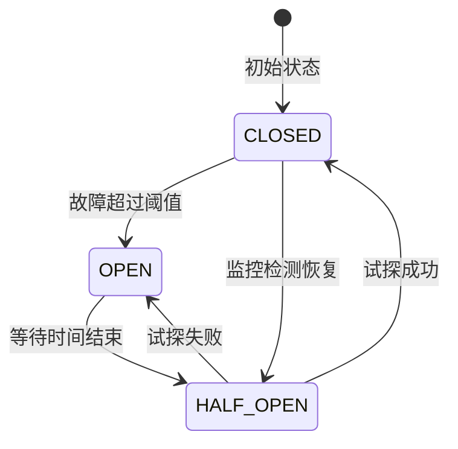

# AI工作流平台 - 容错与降级方案

## 文档信息
- **项目名称**：AI工作流平台
- **文档类型**：容错与降级技术方案
- **版本**：v1.0
- **创建日期**：2026-03-01
- **创建人**：扣子（Worker Agent）

## 1. 概述

### 1.1 目标与原则
构建具备强大容错能力的系统架构，确保在外部服务异常、系统故障、资源不足等情况下，平台仍能提供可接受的服务质量。设计原则包括：

1. **故障隔离**：单个组件故障不影响整体系统
2. **优雅降级**：服务不可用时提供有限功能或友好提示
3. **自动恢复**：故障解除后系统能自动恢复正常
4. **监控告警**：实时检测故障并及时通知运维人员

### 1.2 故障分类
| 故障类型 | 描述 | 影响范围 | 典型场景 |
|---------|------|---------|---------|
| **外部服务故障** | 扣子API不可用、响应超时 | 任务提交、状态查询 | API限流、网络中断 |
| **依赖服务故障** | 数据库、缓存、消息队列异常 | 数据存储、状态同步 | 数据库主从切换、Redis故障 |
| **系统资源故障** | CPU、内存、磁盘资源不足 | 整体系统性能 | 流量激增、内存泄漏 |
| **网络故障** | 网络分区、DNS解析失败 | 跨区域服务调用 | 机房网络故障 |
| **应用代码故障** | 程序Bug、死循环、内存溢出 | 特定功能异常 | 空指针异常、并发问题 |

## 2. 容错架构设计

### 2.1 整体架构
```
┌─────────────────────────────────────────────────────────┐
│                   容错管理层（Fault Tolerance Layer）     │
├─────────────┬─────────────┬─────────────────────────────┤
│  熔断器集群 │  降级处理器 │  资源控制器                   │
│  Circuit Breaker│ Fallback Handler  │ Resource Controller│
└─────────────┴─────────────┴─────────────────────────────┘
          │             │                 │
          ▼             ▼                 ▼
┌─────────────────────────────────────────────────────────┐
│                   业务处理层（Business Layer）            │
├─────────────┬─────────────┬─────────────────────────────┤
│  任务提交器 │  状态同步器 │  结果处理器                   │
│  Task Submitter│ Status Synchronizer │ Result Processor│
└─────────────┴─────────────┴─────────────────────────────┘
```

### 2.2 核心组件说明

#### 2.2.1 熔断器集群（Circuit Breaker Cluster）
**职责**：监控外部服务状态，自动切断异常服务调用

**核心功能**：
- **故障检测**：基于响应时间、错误率、超时率判断服务状态
- **熔断触发**：自动打开熔断，阻止对故障服务的调用
- **半开试探**：定期尝试恢复，验证服务是否正常
- **状态切换**：在开启、关闭、半开状态间自动切换

#### 2.2.2 降级处理器（Fallback Handler）
**职责**：服务不可用时提供替代方案或友好提示

**核心功能**：
- **降级策略选择**：根据故障类型选择合适的降级策略
- **替代数据提供**：使用缓存数据、默认数据或友好提示
- **用户体验保护**：确保用户操作流程不被中断
- **故障隔离**：防止降级策略本身引发新的故障

#### 2.2.3 资源控制器（Resource Controller）
**职责**：监控和管理系统资源，防止资源耗尽

**核心功能**：
- **资源监控**：实时监控CPU、内存、连接池使用率
- **限流控制**：根据系统负载动态调整请求处理速率
- **弹性伸缩**：根据流量变化自动扩缩容
- **故障转移**：自动切换到备用资源或服务

## 3. 熔断器设计

### 3.1 熔断器状态机


### 3.2 熔断器配置
```yaml
# application.yml 熔断器配置
resilience4j:
  circuitbreaker:
    instances:
      # 扣子工作流API熔断器
      coze-workflow-api:
        failure-rate-threshold: 50          # 故障率阈值（%）
        slow-call-rate-threshold: 100       # 慢调用率阈值（%）
        slow-call-duration-threshold: 5000  # 慢调用时间阈值（ms）
        permitted-number-of-calls-in-half-open-state: 3
        sliding-window-type: COUNT_BASED    # 滑动窗口类型
        sliding-window-size: 100            # 滑动窗口大小
        minimum-number-of-calls: 10         # 最小调用次数
        wait-duration-in-open-state: 60s    # 开启状态等待时间
        automatic-transition-from-open-to-half-open-enabled: true
        record-exceptions:
          - java.net.ConnectException
          - java.net.SocketTimeoutException
          - java.io.IOException
          - org.springframework.web.client.ResourceAccessException
          - com.coze.api.CozeApiException
        ignore-exceptions:
          - com.workflow.platform.BusinessValidationException
```

### 3.3 熔断器实现
```java
@Component
@Slf4j
public class CircuitBreakerManager {
    
    @Resource
    private CircuitBreakerRegistry circuitBreakerRegistry;
    
    @Resource
    private MetricsCollector metricsCollector;
    
    /**
     * 使用熔断器执行API调用
     */
    public <T> T executeWithCircuitBreaker(String breakerName, 
                                          Supplier<T> supplier, 
                                          Supplier<T> fallbackSupplier) {
        
        CircuitBreaker circuitBreaker = circuitBreakerRegistry
            .circuitBreaker(breakerName);
        
        // 收集熔断器状态变更
        circuitBreaker.getEventPublisher()
            .onStateTransition(event -> {
                log.info("熔断器状态变更: {} -> {}", 
                    event.getStateTransition().getFromState(), 
                    event.getStateTransition().getToState());
                
                metricsCollector.recordCircuitBreakerTransition(
                    breakerName, 
                    event.getStateTransition()
                );
            });
        
        // 执行熔断器保护的调用
        return Decorators.ofSupplier(supplier)
            .withCircuitBreaker(circuitBreaker)
            .withFallback(Throwable.class, e -> {
                log.warn("熔断器触发，执行降级逻辑: {}", breakerName, e);
                return fallbackSupplier.get();
            })
            .decorate()
            .get();
    }
    
    /**
     * 动态调整熔断器参数
     */
    public void adjustCircuitBreaker(String breakerName, 
                                    CircuitBreakerConfig newConfig) {
        
        CircuitBreaker circuitBreaker = circuitBreakerRegistry
            .circuitBreaker(breakerName);
        
        // 平滑更新配置
        CircuitBreakerConfig.Builder configBuilder = CircuitBreakerConfig
            .from(circuitBreaker.getCircuitBreakerConfig())
            .failureRateThreshold(newConfig.getFailureRateThreshold())
            .slowCallRateThreshold(newConfig.getSlowCallRateThreshold())
            .slowCallDurationThreshold(newConfig.getSlowCallDurationThreshold());
        
        circuitBreakerRegistry.replace(breakerName, 
            circuitBreaker.getName(), 
            configBuilder.build());
        
        log.info("熔断器参数已更新: {} -> {}", 
            breakerName, newConfig);
    }
}
```

### 3.4 熔断器策略矩阵
| 故障模式 | 熔断策略 | 恢复策略 | 监控指标 |
|---------|---------|---------|---------|
| **响应超时** | 慢调用熔断 | 定时试探 | 慢调用率、平均响应时间 |
| **连接异常** | 立即熔断 | 指数退避重试 | 连接失败率、网络延迟 |
| **服务不可用** | 错误率熔断 | 健康检查通过后恢复 | HTTP 5xx错误率 |
| **限流返回** | 部分熔断 | 等待服务恢复 | 429/403错误率 |
| **数据不一致** | 业务熔断 | 手动恢复 | 数据校验失败率 |

## 4. 降级策略设计

### 4.1 降级策略分类

#### 4.1.1 服务降级策略
| 降级级别 | 适用场景 | 具体措施 | 影响范围 |
|---------|---------|---------|---------|
| **无感降级** | 性能轻微下降 | 使用缓存、降低精度 | 用户无感知 |
| **功能降级** | 部分功能异常 | 禁用非核心功能 | 用户体验轻微下降 |
| **页面降级** | 关键API异常 | 展示静态页面或提示 | 功能不可用但可访问 |
| **只读降级** | 写服务异常 | 限制为只读操作 | 无法创建/更新数据 |
| **系统降级** | 严重故障 | 临时关闭系统 | 服务完全不可用 |

#### 4.1.2 数据降级策略
```java
@Component
public class DataDegradationManager {
    
    @Resource
    private CacheService cacheService;
    
    @Resource
    private DefaultDataProvider defaultDataProvider;
    
    /**
     * 多级数据降级策略
     */
    public Object getWithDegradation(String dataKey, 
                                    Supplier<Object> primarySupplier) {
        
        try {
            // 1. 优先使用缓存
            Object cached = cacheService.get(dataKey);
            if (cached != null) {
                log.debug("使用缓存数据: {}", dataKey);
                return cached;
            }
            
            // 2. 尝试主数据源
            Object primaryData = primarySupplier.get();
            if (primaryData != null) {
                // 更新缓存
                cacheService.set(dataKey, primaryData, 
                    DEFAULT_CACHE_TTL);
                return primaryData;
            }
            
            // 3. 使用降级数据
            log.warn("使用降级数据: {}", dataKey);
            return getDegradedData(dataKey);
            
        } catch (Exception e) {
            // 4. 使用默认数据
            log.error("数据获取失败，使用默认数据: {}", dataKey, e);
            return defaultDataProvider.getDefaultData(dataKey);
        }
    }
    
    /**
     * 工作流元数据降级策略
     */
    public WorkflowMetadata getWorkflowMetadata(String workflowId) {
        return getWithDegradation(
            "workflow:meta:" + workflowId,
            () -> cozeApiClient.getWorkflowMetadata(workflowId)
        );
    }
}
```

### 4.2 智能降级决策

#### 4.2.1 降级决策引擎
```java
@Component
public class DegradationDecisionEngine {
    
    @Resource
    private SystemMonitor systemMonitor;
    
    @Resource
    private UserPriorityService userPriorityService;
    
    /**
     * 智能降级决策
     */
    public DegradationDecision makeDecision(DegradationContext context) {
        
        DegradationDecision decision = new DegradationDecision();
        
        // 1. 评估系统状态
        SystemHealth health = systemMonitor.getCurrentHealth();
        LoadLevel loadLevel = calculateLoadLevel(health);
        
        // 2. 考虑用户优先级
        UserPriority priority = userPriorityService.getPriority(
            context.getUserId());
        
        // 3. 评估故障影响
        FailureImpact impact = evaluateFailureImpact(context);
        
        // 4. 制定降级策略
        decision.setStrategy(selectStrategy(loadLevel, priority, impact));
        
        // 5. 确定恢复条件
        decision.setRecoveryConditions(determineRecoveryConditions(
            context, health));
        
        // 6. 设置监控规则
        decision.setMonitoringRules(generateMonitoringRules(
            context.getServiceType()));
        
        return decision;
    }
    
    private DegradationStrategy selectStrategy(LoadLevel loadLevel, 
                                              UserPriority priority, 
                                              FailureImpact impact) {
        
        // 决策矩阵
        if (loadLevel == LoadLevel.CRITICAL) {
            if (priority == UserPriority.VIP) {
                return DegradationStrategy.PARTIAL_FUNCTION;
            } else {
                return DegradationStrategy.READ_ONLY;
            }
        } else if (loadLevel == LoadLevel.HIGH) {
            if (impact == FailureImpact.HIGH) {
                return DegradationStrategy.CACHE_ONLY;
            } else {
                return DegradationStrategy.PERFORMANCE_DEGRADE;
            }
        } else {
            return DegradationStrategy.NONE;
        }
    }
}
```

#### 4.2.2 动态降级配置
```yaml
# degradation-config.yml
degradation:
  strategies:
    # 服务不可用降级
    service-unavailable:
      type: SERVICE_DEGRADE
      priority: 1
      conditions:
        - error-rate > 80%
        - response-time-p95 > 10000ms
      actions:
        - enable-cache: true
        - show-degradation-message: true
        - limit-functionality: ["task-creation", "real-time-update"]
      recovery:
        condition: error-rate < 5% for 5min
        actions:
          - disable-cache: false
          - restore-full-functionality: true
    
    # 高负载降级
    high-load:
      type: PERFORMANCE_DEGRADE
      priority: 2
      conditions:
        - cpu-usage > 85%
        - memory-usage > 90%
      actions:
        - limit-concurrent-requests: 50
        - disable-background-jobs: ["data-sync", "report-generation"]
        - enable-rate-limit: true
      recovery:
        condition: cpu-usage < 60% for 10min
        actions:
          - restore-concurrent-limit: 200
          - enable-background-jobs: true
```

## 5. 资源控制设计

### 5.1 自适应限流

#### 5.1.1 令牌桶算法实现
```java
@Component
public class AdaptiveRateLimiter {
    
    private final Map<String, RateLimiter> limiters = new ConcurrentHashMap<>();
    private final ScheduledExecutorService scheduler = 
        Executors.newScheduledThreadPool(2);
    
    /**
     * 自适应限流器
     */
    public boolean tryAcquire(String resourceKey) {
        RateLimiter limiter = limiters.computeIfAbsent(resourceKey, 
            key -> createRateLimiter(key));
        
        // 根据系统负载动态调整
        adjustRateBasedOnLoad(limiter);
        
        return limiter.tryAcquire();
    }
    
    private RateLimiter createRateLimiter(String resourceKey) {
        // 初始配置
        RateLimiterConfig config = RateLimiterConfig.custom()
            .limitForPeriod(100)  // 初始限流100/秒
            .limitRefreshPeriod(Duration.ofSeconds(1))
            .timeoutDuration(Duration.ofSeconds(5))
            .build();
        
        RateLimiter limiter = RateLimiter.of(resourceKey, config);
        
        // 启动自适应调整线程
        scheduler.scheduleAtFixedRate(
            () -> adaptRate(limiter, resourceKey),
            30, 30, TimeUnit.SECONDS
        );
        
        return limiter;
    }
    
    private void adaptRate(RateLimiter limiter, String resourceKey) {
        // 获取当前系统指标
        SystemMetrics metrics = systemMonitor.getMetrics();
        
        // 计算新的限流值
        int newLimit = calculateOptimalRate(
            metrics.getCpuUsage(),
            metrics.getMemoryUsage(),
            metrics.getResponseTimeP95(),
            getCurrentRequestRate(resourceKey)
        );
        
        // 平滑更新（避免剧烈变化）
        smoothUpdate(limiter, newLimit);
    }
}
```

#### 5.1.2 多维度限流策略
| 维度 | 策略 | 适用场景 | 实现方式 |
|------|------|---------|---------|
| **用户级** | 基于用户ID限流 | 防止单一用户滥用 | Redis计数+滑动窗口 |
| **IP级** | 基于IP地址限流 | 防止DDoS攻击 | IP黑名单+速率限制 |
| **资源级** | 基于API路径限流 | 保护关键接口 | 服务端限流配置 |
| **全局级** | 系统总请求限流 | 防止系统过载 | 网关层全局限流 |

### 5.2 弹性伸缩设计

#### 5.2.1 自动扩缩容策略
```yaml
# autoscaling-config.yml
autoscaling:
  rules:
    # CPU扩缩容
    cpu-based:
      metric: CPU_UTILIZATION
      threshold: 70%
      scaling-out:
        cool-down: 300    # 5分钟冷却
        step-size: 2     # 每次扩容2个实例
        max-instances: 20 # 最大实例数
      scaling-in:
        cool-down: 600    # 10分钟冷却
        step-size: 1      # 每次缩容1个实例
        min-instances: 2  # 最小实例数
    
    # 内存扩缩容
    memory-based:
      metric: MEMORY_UTILIZATION
      threshold: 80%
      scaling-out:
        cool-down: 300
        step-size: 2
        max-instances: 20
      scaling-in:
        cool-down: 600
        step-size: 1
        min-instances: 2
    
    # 请求队列扩缩容
    queue-based:
      metric: REQUEST_QUEUE_SIZE
      threshold: 1000
      scaling-out:
        cool-down: 60     # 1分钟（紧急扩容）
        step-size: 3      # 每次扩容3个实例
        max-instances: 30
```

## 6. 故障恢复设计

### 6.1 自动恢复机制

#### 6.1.1 健康检查与自愈
```java
@Component
public class SelfHealingSystem {
    
    @Resource
    private HealthCheckService healthCheckService;
    
    @Resource
    private RecoveryExecutor recoveryExecutor;
    
    /**
     * 系统自愈主流程
     */
    @Scheduled(fixedDelay = 30000) // 每30秒检查一次
    public void selfHealing() {
        // 1. 执行全面健康检查
        Map<String, HealthStatus> healthStatus = 
            healthCheckService.checkAllComponents();
        
        // 2. 识别需要恢复的组件
        List<RecoveryAction> actions = identifyRecoveryActions(
            healthStatus);
        
        // 3. 按优先级执行恢复
        executeRecoveryActions(actions);
        
        // 4. 验证恢复效果
        verifyRecovery(healthStatus);
    }
    
    private List<RecoveryAction> identifyRecoveryActions(
        Map<String, HealthStatus> healthStatus) {
        
        List<RecoveryAction> actions = new ArrayList<>();
        
        for (Map.Entry<String, HealthStatus> entry : healthStatus.entrySet()) {
            String component = entry.getKey();
            HealthStatus status = entry.getValue();
            
            if (status == HealthStatus.FAILING) {
                // 根据组件类型确定恢复策略
                RecoveryStrategy strategy = selectRecoveryStrategy(
                    component, status.getMetrics());
                
                actions.add(RecoveryAction.builder()
                    .component(component)
                    .strategy(strategy)
                    .priority(strategy.getPriority())
                    .build());
            }
        }
        
        return actions;
    }
}
```

#### 6.1.2 渐进式恢复策略
| 故障阶段 | 恢复策略 | 恢复目标 | 操作步骤 |
|---------|---------|---------|---------|
| **故障初期** | 快速恢复 | 最小化影响 | 1. 重试机制 2. 服务重启 3. 负载转移 |
| **故障中期** | 稳定恢复 | 恢复核心功能 | 1. 隔离故障 2. 降级运行 3. 逐步恢复 |
| **故障后期** | 完全恢复 | 恢复正常运行 | 1. 全面检查 2. 数据同步 3. 监控验证 |

### 6.2 数据一致性保障

#### 6.2.1 最终一致性方案
```java
@Component
public class EventualConsistencyManager {
    
    @Resource
    private MessageQueueService messageQueueService;
    
    @Resource
    private ReconciliationService reconciliationService;
    
    /**
     * 保证数据最终一致性
     */
    public void ensureConsistency(String taskId) {
        // 1. 发布状态变更事件
        TaskStatusEvent event = TaskStatusEvent.builder()
            .taskId(taskId)
            .eventType(TaskEventType.STATUS_UPDATED)
            .timestamp(System.currentTimeMillis())
            .build();
        
        messageQueueService.publish("task-status-events", event);
        
        // 2. 延迟检查（10分钟后）
        scheduler.schedule(() -> {
            checkAndReconcile(taskId);
        }, 10, TimeUnit.MINUTES);
    }
    
    private void checkAndReconcile(String taskId) {
        // 检查数据一致性
        ConsistencyCheckResult result = reconciliationService
            .checkTaskConsistency(taskId);
        
        if (!result.isConsistent()) {
            log.warn("数据不一致，启动修复: taskId={}", taskId);
            
            // 执行修复
            reconciliationService.reconcileTask(taskId, result);
            
            // 记录修复事件
            auditService.logRepairEvent(taskId, result);
        }
    }
}
```

## 7. 监控与告警

### 7.1 关键监控指标
| 指标类别 | 指标名称 | 采集频率 | 告警阈值 | 恢复条件 |
|---------|---------|---------|---------|---------|
| **服务可用性** | API成功率 | 1分钟 | < 95% | > 99% for 5min |
| | 熔断器开启比例 | 5分钟 | > 30% | < 10% for 10min |
| **系统性能** | 响应时间P95 | 1分钟 | > 5000ms | < 2000ms for 5min |
| | 系统负载 | 30秒 | > 80% | < 60% for 10min |
| **业务健康** | 降级服务比例 | 5分钟 | > 20% | < 5% for 15min |
| | 数据不一致率 | 10分钟 | > 5% | < 1% for 30min |

### 7.2 智能告警系统
```java
@Component
public class IntelligentAlertSystem {
    
    @Resource
    private MetricsAnalyzer metricsAnalyzer;
    
    @Resource
    private AlertEscalationService escalationService;
    
    /**
     * 智能告警处理
     */
    public AlertResponse handleAlert(AlertEvent event) {
        
        // 1. 分析告警严重程度
        AlertSeverity severity = analyzeSeverity(event);
        
        // 2. 检查是否需要升级告警
        if (shouldEscalate(event, severity)) {
            escalationService.escalate(event, severity);
        }
        
        // 3. 根据严重程度采取行动
        switch (severity) {
            case CRITICAL:
                return handleCriticalAlert(event);
            case HIGH:
                return handleHighAlert(event);
            case MEDIUM:
                return handleMediumAlert(event);
            case LOW:
                return handleLowAlert(event);
            default:
                return handleInformationalAlert(event);
        }
    }
    
    private AlertSeverity analyzeSeverity(AlertEvent event) {
        // 综合多个维度分析
        double score = 0;
        
        // 1. 故障影响范围
        score += calculateImpactScore(event.getImpactScope());
        
        // 2. 故障持续时间
        score += calculateDurationScore(event.getDuration());
        
        // 3. 系统关键度
        score += calculateCriticalityScore(event.getSystemComponent());
        
        // 4. 历史故障频率
        score += calculateFrequencyScore(event.getComponent());
        
        // 根据总分确定严重程度
        if (score >= 80) return AlertSeverity.CRITICAL;
        if (score >= 60) return AlertSeverity.HIGH;
        if (score >= 40) return AlertSeverity.MEDIUM;
        if (score >= 20) return AlertSeverity.LOW;
        return AlertSeverity.INFORMATIONAL;
    }
}
```

## 8. 灾难恢复设计

### 8.1 多区域部署架构
```
┌─────────────────────────────────────────────────────────┐
│                     区域A（主区域）                       │
├─────────────┬─────────────┬─────────────────────────────┤
│  应用集群   │  数据库主库 │  Redis主节点                 │
│  App Cluster│  MySQL Master│  Redis Master             │
└─────────────┴─────────────┴─────────────────────────────┘
                    │              │
                    ▼              ▼
┌─────────────────────────────────────────────────────────┐
│                     区域B（备区域）                       │
├─────────────┬─────────────┬─────────────────────────────┤
│  应用集群   │  数据库从库 │  Redis从节点                 │
│  App Cluster│  MySQL Slave │  Redis Slave              │
└─────────────┴─────────────┴─────────────────────────────┘
```

### 8.2 故障切换流程
```java
@Component
public class FailoverManager {
    
    @Resource
    private RegionMonitor regionMonitor;
    
    @Resource
    private TrafficRedirector trafficRedirector;
    
    @Resource
    private DataSyncService dataSyncService;
    
    /**
     * 执行故障切换
     */
    public FailoverResult executeFailover(FailoverRequest request) {
        
        FailoverResult result = new FailoverResult();
        
        // 1. 验证故障
        if (!validateFailure(request.getRegion(), request.getFailureType())) {
            result.setStatus(FailoverStatus.REJECTED);
            return result;
        }
        
        // 2. 启动故障切换
        log.info("开始故障切换: region={}, failure={}", 
            request.getRegion(), request.getFailureType());
        
        // 3. 切换到备用区域
        switchToBackupRegion(request.getRegion());
        
        // 4. 重定向流量
        trafficRedirector.redirectTraffic(request.getRegion(), 
            request.getBackupRegion());
        
        // 5. 同步数据
        dataSyncService.syncCriticalData(request.getRegion(), 
            request.getBackupRegion());
        
        // 6. 验证切换结果
        result.setStatus(verifyFailover() ? 
            FailoverStatus.COMPLETED : FailoverStatus.FAILED);
        
        return result;
    }
    
    private void switchToBackupRegion(String primaryRegion) {
        // 切换数据库主从
        databaseFailoverService.switchMaster(primaryRegion);
        
        // 切换缓存
        redisFailoverService.promoteSlave(primaryRegion);
        
        // 更新配置中心
        configCenterService.updateActiveRegion(primaryRegion);
        
        log.info("区域切换完成: {} -> {}", primaryRegion, 
            getBackupRegion(primaryRegion));
    }
}
```

## 9. 测试与演练

### 9.1 容错测试方案
| 测试类型 | 测试场景 | 测试工具 | 预期结果 |
|---------|---------|---------|---------|
| **故障注入测试** | 模拟扣子API超时 | Chaos Monkey | 熔断器触发，服务降级 |
| | 模拟数据库连接失败 | ChaosBlade | 只读模式，用户体验无损 |
| **压力测试** | 高并发任务提交 | JMeter | 系统自动限流，服务稳定 |
| | 大流量突发访问 | Locust | 弹性扩容，响应时间可控 |
| **恢复测试** | 模拟网络分区恢复 | Toxiproxy | 数据自动同步，服务正常 |
| | 模拟系统重启 | K6 | 服务快速恢复，无数据丢失 |

### 9.2 应急预案演练
1. **演练频率**：每季度至少一次
2. **演练内容**：
   - 扣子API不可用场景
   - 数据库故障场景
   - 网络分区场景
   - DDoS攻击场景
3. **演练评估**：
   - 故障发现时间
   - 故障恢复时间
   - 数据一致性验证
   - 用户体验评估

## 10. 附录

### 10.1 配置参数参考
```properties
# 熔断器配置
resilience4j.circuitbreaker.instances.coze-api.failure-rate-threshold=50
resilience4j.circuitbreaker.instances.coze-api.slow-call-rate-threshold=100
resilience4j.circuitbreaker.instances.coze-api.slow-call-duration-threshold=5000
resilience4j.circuitbreaker.instances.coze-api.wait-duration-in-open-state=60s

# 限流配置
resilience4j.ratelimiter.instances.api-global.limit-for-period=500
resilience4j.ratelimiter.instances.api-global.limit-refresh-period=1s
resilience4j.ratelimiter.instances.api-global.timeout-duration=5s

# 降级配置
degradation.enabled=true
degradation.cache-ttl=300s
degradation.default-response-timeout=3000
degradation.critical-load-threshold=80

# 监控配置
monitoring.alert.enabled=true
monitoring.alert.critical-threshold=90
monitoring.alert.warning-threshold=70
monitoring.alert.recovery-threshold=95
```

### 10.2 故障处理流程清单
- [ ] 故障检测：系统自动检测到服务异常
- [ ] 告警通知：根据严重程度通知相关人员
- [ ] 熔断保护：自动切断对故障服务的调用
- [ ] 服务降级：启用备用方案，保证核心功能
- [ ] 故障隔离：防止故障扩散到其他组件
- [ ] 故障定位：分析故障根本原因
- [ ] 修复实施：执行故障修复方案
- [ ] 恢复验证：验证服务恢复正常
- [ ] 流程回顾：总结故障处理经验
- [ ] 优化改进：改进系统容错能力

---

**文档版本记录**
| 版本 | 日期 | 修改内容 | 修改人 |
|------|------|---------|-------|
| v1.0 | 2026-03-01 | 初始版本创建 | 扣子 |

