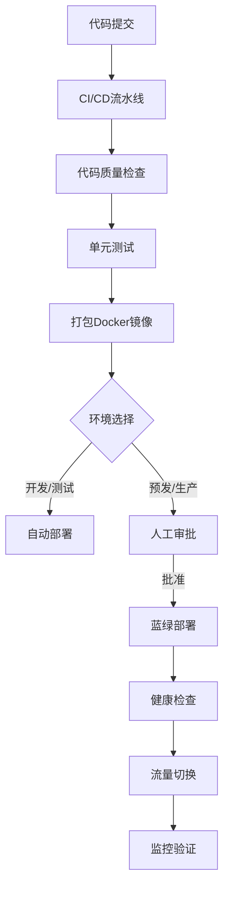

# AI工作流平台 - 扣子工作流集成架构设计方案

## 文档信息
- **项目名称**：AI工作流平台
- **文档类型**：集成架构设计
- **版本**：v1.0
- **创建日期**：2026-03-01
- **创建人**：扣子（Worker Agent）

## 1. 集成目标与原则

### 1.1 核心目标
构建稳定、高效、可扩展的扣子工作流集成体系，实现以下能力：
1. **任务提交**：将用户创建的任务安全、准确地提交到扣子平台
2. **状态同步**：实时跟踪任务执行状态，保持内外状态一致
3. **结果获取**：可靠地获取任务执行结果并存储
4. **资源管理**：准确计算和控制资源点消耗
5. **容错处理**：保障系统在异常情况下的可用性

### 1.2 设计原则
1. **高可用性**：确保集成服务7x24小时稳定运行
2. **可扩展性**：支持业务增长，轻松应对流量变化
3. **安全性**：保护用户数据和系统资源安全
4. **可观测性**：全面监控，快速定位和解决问题
5. **成本效益**：合理利用资源，控制运营成本

## 2. 整体架构设计

### 2.1 架构概览
```
┌─────────────────────────────────────────────────────────────┐
│                    AI工作流平台（用户端）                     │
├─────────────────────────────────────────────────────────────┤
│  Android App │ 后台管理系统 │ API网关 │ 业务服务 │ 数据存储    │
└─────────────────────────────────────────────────────────────┘
                                   │
                                   ▼
┌─────────────────────────────────────────────────────────────┐
│                   扣子工作流集成层（核心）                      │
├─────────────────────────────────────────────────────────────┤
│  任务调度器  │ API客户端集群 │ 状态同步器 │ 结果处理器          │
└─────────────────────────────────────────────────────────────┘
                                   │
                                   ▼
┌─────────────────────────────────────────────────────────────┐
│                     扣子平台API服务                            │
├─────────────────────────────────────────────────────────────┤
│  执行工作流API │ 查询结果API │ 文件上传API │ 流式响应API        │
└─────────────────────────────────────────────────────────────┘
```

### 2.2 核心组件说明

#### 2.2.1 任务调度器（Task Scheduler）
**职责**：接收用户任务请求，进行预处理和路由分发

**核心功能**：
- 参数验证与格式化
- 资源点预扣检查
- 任务优先级调度
- 并发控制与限流
- 失败重试策略

**技术实现**：
- Spring Task/Quartz Scheduler
- 优先级队列（Redis Sorted Set）
- 分布式锁（Redisson）

#### 2.2.2 API客户端集群（API Client Cluster）
**职责**：封装扣子平台API调用，提供统一的接口

**核心功能**：
- 请求签名与认证
- 连接池管理
- 超时与重试控制
- 响应解析与异常处理
- 性能监控与统计

**技术实现**：
- 基于OkHttp3的HTTP客户端
- 连接池配置（最大200连接，空闲5分钟）
- 熔断器（Resilience4j）

#### 2.2.3 状态同步器（Status Synchronizer）
**职责**：实时同步任务执行状态，保持数据一致性

**核心功能**：
- 轮询机制实现
- 状态映射与转换
- 进度计算与更新
- 异常状态检测
- 实时通知推送

**技术实现**：
- 定时任务调度
- WebSocket长连接
- 事件驱动架构

#### 2.2.4 结果处理器（Result Processor）
**职责**：处理任务执行结果，存储并提供下载

**核心功能**：
- 结果解析与验证
- 文件存储与CDN加速
- 结果元数据提取
- 清理与归档策略
- 下载链接生成

**技术实现**：
- 阿里云OSS对象存储
- CDN加速服务
- 文件校验（MD5/SHA256）

## 3. 详细设计

### 3.1 请求封装层设计

#### 3.1.1 请求工厂模式
```java
public interface CozeApiRequestFactory {
    // 创建工作流执行请求
    CozeApiRequest createWorkflowRunRequest(String workflowId, Map<String, Object> params);
    
    // 创建查询结果请求
    CozeApiRequest createWorkflowRetrieveRequest(String workflowId, String executeId);
    
    // 创建文件上传请求
    CozeApiRequest createFileUploadRequest(File file, String purpose);
}

// 具体实现
@Component
public class CozeApiRequestFactoryImpl implements CozeApiRequestFactory {
    @Value("${coze.api.base-url}")
    private String baseUrl;
    
    @Value("${coze.api.token}")
    private String apiToken;
    
    @Override
    public CozeApiRequest createWorkflowRunRequest(String workflowId, Map<String, Object> params) {
        String url = baseUrl + "/v1/workflow/run";
        Map<String, Object> body = new HashMap<>();
        body.put("workflow_id", workflowId);
        body.put("parameters", params);
        body.put("is_async", true); // 默认使用异步模式
        
        return CozeApiRequest.builder()
            .url(url)
            .method(HttpMethod.POST)
            .headers(buildAuthHeaders())
            .body(body)
            .timeout(5000) // 5秒超时
            .retryConfig(RetryConfig.ofDefault())
            .build();
    }
}
```

#### 3.1.2 请求重试策略
| 错误类型 | 重试次数 | 退避策略 | 最大等待时间 |
|---------|---------|---------|------------|
| 网络超时 | 3次 | 指数退避 | 30秒 |
| 服务不可用（5xx） | 2次 | 固定间隔 | 10秒 |
| 限流（429） | 3次 | 指数退避 | 60秒 |
| 参数错误（4xx） | 0次 | 不重试 | - |

**实现代码**：
```java
@Configuration
public class RetryConfiguration {
    
    @Bean
    public RetryConfig workflowRunRetryConfig() {
        return RetryConfig.custom()
            .maxAttempts(3)
            .intervalFunction(IntervalFunction.ofExponentialBackoff(1000, 2.0))
            .retryOnException(e -> e instanceof SocketTimeoutException)
            .failAfterMaxAttempts(true)
            .build();
    }
    
    @Bean
    public Retry rateLimitRetryConfig() {
        return Retry.of("rateLimitRetry", RetryConfig.custom()
            .maxAttempts(3)
            .intervalFunction(IntervalFunction.ofExponentialBackoff(2000, 2.0))
            .retryOnException(e -> e instanceof RateLimitException)
            .build());
    }
}
```

### 3.2 错误处理与熔断机制

#### 3.2.1 错误分类体系
```java
public enum CozeApiErrorType {
    // 客户端错误
    CLIENT_ERROR(400, "请求参数错误"),
    AUTH_ERROR(401, "认证失败"),
    PERMISSION_ERROR(403, "权限不足"),
    RESOURCE_NOT_FOUND(404, "资源不存在"),
    RATE_LIMIT(429, "请求频率超限"),
    
    // 服务端错误
    SERVER_ERROR(500, "服务器内部错误"),
    SERVICE_UNAVAILABLE(503, "服务不可用"),
    TIMEOUT(408, "请求超时"),
    
    // 业务错误
    WORKFLOW_NOT_PUBLISHED(4200, "工作流未发布"),
    EXECUTION_TIMEOUT(6003, "工作流执行超时"),
    NODE_EXECUTION_FAILED(6005, "节点执行失败");
    
    private final int code;
    private final String message;
    
    // 构造方法、getter省略
}
```

#### 3.2.2 熔断器配置
```yaml
# application.yml 配置
resilience4j:
  circuitbreaker:
    instances:
      coze-workflow-api:
        failure-rate-threshold: 50
        sliding-window-size: 100
        minimum-number-of-calls: 10
        permitted-number-of-calls-in-half-open-state: 3
        automatic-transition-from-open-to-half-open-enabled: true
        wait-duration-in-open-state: 60s
        record-exceptions:
          - java.io.IOException
          - java.net.SocketTimeoutException
          - org.springframework.web.client.ResourceAccessException
```

### 3.3 并发控制设计

#### 3.3.1 并发限制策略
| 资源类型 | 最大并发数 | 队列容量 | 拒绝策略 |
|---------|-----------|---------|---------|
| 普通工作流 | 100 | 1000 | 等待（最大30秒） |
| 视频处理 | 20 | 200 | 立即拒绝 |
| 图像处理 | 50 | 500 | 等待（最大60秒） |

#### 3.3.2 实现方案
```java
@Component
public class ConcurrencyController {
    
    @Resource
    private RedisTemplate<String, String> redisTemplate;
    
    private static final int MAX_CONCURRENT_JOBS = 100;
    private static final String CONCURRENT_JOBS_KEY = "coze:concurrent:jobs";
    private static final String JOB_QUEUE_KEY = "coze:queue:jobs";
    
    public boolean acquireJobSlot(String jobId) {
        // 检查当前并发数
        Long currentJobs = redisTemplate.opsForValue().increment(CONCURRENT_JOBS_KEY, 1);
        if (currentJobs == null) {
            return false;
        }
        
        if (currentJobs > MAX_CONCURRENT_JOBS) {
            // 超出限制，回滚计数
            redisTemplate.opsForValue().decrement(CONCURRENT_JOBS_KEY, 1);
            return false;
        }
        
        // 设置过期时间，防止死锁
        redisTemplate.expire(CONCURRENT_JOBS_KEY, 30, TimeUnit.MINUTES);
        return true;
    }
    
    public void releaseJobSlot() {
        redisTemplate.opsForValue().decrement(CONCURRENT_JOBS_KEY, 1);
    }
}
```

### 3.4 性能优化设计

#### 3.4.1 连接池优化
```yaml
# OkHttp3 连接池配置
okhttp:
  max-idle-connections: 200
  keep-alive-duration: 300000  # 5分钟
  connect-timeout: 5000        # 5秒连接超时
  read-timeout: 30000          # 30秒读取超时
  write-timeout: 30000         # 30秒写入超时
```

#### 3.4.2 缓存策略
| 数据类型 | 缓存时间 | 缓存介质 | 更新策略 |
|---------|---------|---------|---------|
| 工作流元数据 | 1小时 | Redis | 主动更新 |
| 任务状态 | 5分钟 | Redis | 被动更新 |
| 文件元信息 | 24小时 | Redis | 事件驱动 |
| API响应 | 30秒 | 内存缓存 | 条件缓存 |

### 3.5 监控与告警设计

#### 3.5.1 关键监控指标
| 指标类别 | 具体指标 | 告警阈值 | 监控频率 |
|---------|---------|---------|---------|
| **可用性** | API成功率 | < 95% | 1分钟 |
| | 响应时间P95 | > 5秒 | 1分钟 |
| **业务** | 任务提交量 | - | 5分钟 |
| | 成功任务数 | - | 5分钟 |
| | 失败任务数 | > 100/小时 | 5分钟 |
| **资源** | 并发连接数 | > 180 | 1分钟 |
| | 内存使用率 | > 80% | 1分钟 |

#### 3.5.2 告警策略
```java
@Component
public class MonitoringAlertManager {
    
    @Resource
    private AlertService alertService;
    
    public void checkApiHealth(ApiMetrics metrics) {
        // API成功率告警
        if (metrics.getSuccessRate() < 0.95) {
            Alert alert = Alert.builder()
                .level(AlertLevel.WARNING)
                .title("扣子API成功率下降")
                .content(String.format("当前成功率: %.2f%%, 阈值: 95%%", 
                    metrics.getSuccessRate() * 100))
                .tags(Arrays.asList("coze-api", "availability"))
                .build();
            alertService.sendAlert(alert);
        }
        
        // 响应时间告警
        if (metrics.getP95ResponseTime() > 5000) {
            Alert alert = Alert.builder()
                .level(AlertLevel.WARNING)
                .title("扣子API响应时间异常")
                .content(String.format("P95响应时间: %dms, 阈值: 5000ms", 
                    metrics.getP95ResponseTime()))
                .tags(Arrays.asList("coze-api", "performance"))
                .build();
            alertService.sendAlert(alert);
        }
    }
}
```

## 4. 部署架构

### 4.1 物理架构设计
```
┌─────────────────────────────────────────────────────────────┐
│                   负载均衡层（SLB）                           │
├─────────────────┬─────────────┬─────────────────────────────┤
│  应用实例1      │ 应用实例2    │ 应用实例N                    │
├─────────────────┼─────────────┼─────────────────────────────┤
│  SpringBoot应用 │ 任务调度器   │ 监控代理                     │
│  API客户端集群  │ 状态同步器   │ 日志收集器                   │
│  缓存管理器    │ 熔断器管理   │ 性能监控器                   │
└─────────────────┴─────────────┴─────────────────────────────┘
                                   │
                                   ▼
┌─────────────────────────────────────────────────────────────┐
│                    中间件集群                                 │
├─────────────────┬─────────────┬─────────────────────────────┤
│  Redis哨兵模式   │ MySQL主从   │ 消息队列集群                 │
│  3节点部署      │ 读写分离    │ （RocketMQ）                 │
└─────────────────┴─────────────┴─────────────────────────────┘
```

### 4.2 高可用配置
| 组件 | 部署模式 | 容灾策略 | 恢复时间目标（RTO） |
|------|---------|---------|-------------------|
| 应用服务 | 多可用区部署 | 自动故障转移 | < 5分钟 |
| Redis | 哨兵模式（3节点） | 主从切换 | < 30秒 |
| MySQL | 主从复制 | 手动切换 | < 10分钟 |
| 对象存储 | 跨区域复制 | 数据冗余 | < 1小时 |

### 4.3 扩缩容策略
| 指标 | 扩容阈值 | 扩容步长 | 缩容阈值 | 缩容步长 |
|------|---------|---------|---------|---------|
| CPU使用率 | > 70% | 增加1个实例 | < 30% | 减少1个实例 |
| 内存使用率 | > 80% | 增加1个实例 | < 40% | 减少1个实例 |
| 响应时间P95 | > 3秒 | 增加1个实例 | < 1秒 | 保持当前 |
| 并发任务数 | > 80% | 增加2个实例 | < 30% | 减少1个实例 |

## 5. 安全设计

### 5.1 访问控制策略
1. **API访问控制**：
   - 基于IP白名单的访问限制
   - API密钥轮换机制（每月更换）
   - 访问频率限制（基于用户+IP组合）

2. **数据传输安全**：
   - 强制HTTPS加密传输
   - TLS 1.3协议支持
   - 证书自动续期和监控

3. **数据存储安全**：
   - 敏感数据加密存储（AES-256）
   - 访问日志审计
   - 数据备份与恢复测试

### 5.2 密钥管理方案
```java
@Component
public class SecretManager {
    
    @Resource
    private VaultTemplate vaultTemplate;
    
    // 获取扣子API Token
    public String getCozeApiToken() {
        VaultResponseSupport<Map<String, Object>> response = 
            vaultTemplate.read("secret/data/coze/api-token");
        
        if (response != null && response.getData() != null) {
            return (String) response.getData().get("token");
        }
        
        // 降级：使用环境变量或配置文件
        return System.getenv("COZE_API_TOKEN");
    }
    
    // 轮换API Token
    public void rotateApiToken(String newToken) {
        Map<String, Object> data = new HashMap<>();
        data.put("token", newToken);
        
        vaultTemplate.write("secret/data/coze/api-token", 
            Collections.singletonMap("data", data));
        
        // 异步更新所有应用实例
        refreshAllInstances();
    }
}
```

## 6. 测试策略

### 6.1 测试类型与范围
| 测试类型 | 测试范围 | 自动化程度 | 执行频率 |
|---------|---------|-----------|---------|
| **单元测试** | API客户端、工具类 | 100% | 每次提交 |
| **集成测试** | 扣子API调用、任务流转 | 80% | 每日构建 |
| **性能测试** | 并发处理、响应时间 | 70% | 版本发布前 |
| **安全测试** | 认证授权、数据加密 | 50% | 每月一次 |
| **容灾测试** | 故障转移、数据恢复 | 30% | 每季度一次 |

### 6.2 性能基准测试
| 场景 | 并发用户数 | 平均响应时间 | 成功率 | 资源消耗 |
|------|-----------|------------|-------|---------|
| 提交简单任务 | 100 | < 500ms | > 99.9% | CPU<30%, Mem<500MB |
| 提交视频任务 | 20 | < 2000ms | > 99% | CPU<50%, Mem<1GB |
| 批量查询状态 | 50 | < 300ms | > 99.9% | CPU<40%, Mem<300MB |

## 7. 部署与运维

### 7.1 部署流程


### 7.2 运维检查清单
- [ ] 系统资源监控告警配置
- [ ] 日志收集与分析系统就绪
- [ ] 备份策略验证
- [ ] 灾难恢复预案
- [ ] 安全审计配置
- [ ] 性能基准测试完成

## 8. 附录

### 8.1 配置参数参考
```properties
# 扣子API配置
coze.api.base-url=https://api.coze.cn
coze.api.token=${COZE_API_TOKEN:}
coze.api.timeout.connect=5000
coze.api.timeout.read=30000
coze.api.timeout.write=30000

# 连接池配置
coze.api.pool.max-idle=200
coze.api.pool.keep-alive=300000
coze.api.pool.max-requests=100

# 重试配置
coze.api.retry.max-attempts=3
coze.api.retry.backoff.multiplier=2.0
coze.api.retry.backoff.initial-interval=1000

# 监控配置
coze.monitor.enabled=true
coze.monitor.interval=60000
coze.monitor.slack-webhook=${SLACK_WEBHOOK:}
```

### 8.2 性能监控指标定义
| 指标名称 | 计算公式 | 采集频率 | 告警阈值 |
|---------|---------|---------|---------|
| API成功率 | (成功请求数 / 总请求数) × 100% | 1分钟 | < 95% |
| 平均响应时间 | Σ响应时间 / 总请求数 | 1分钟 | > 3000ms |
| P95响应时间 | 排序后第95百分位的响应时间 | 1分钟 | > 5000ms |
| 并发连接数 | 当前活跃连接数 | 30秒 | > 180 |
| 错误率 | (错误请求数 / 总请求数) × 100% | 1分钟 | > 5% |

---

**文档版本记录**
| 版本 | 日期 | 修改内容 | 修改人 |
|------|------|---------|-------|
| v1.0 | 2026-03-01 | 初始版本创建 | 扣子 |

