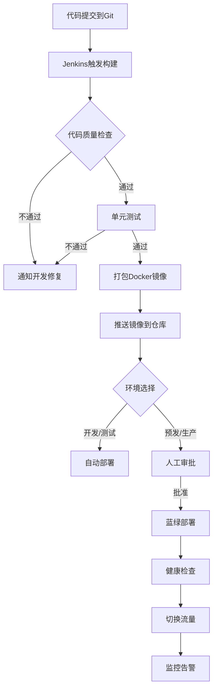

# AI工作流平台技术方案文档

## 文档信息
- **项目名称**：AI工作流平台（Android App + 后台管理系统）
- **版本**：v1.0
- **创建日期**：2026-03-01
- **创建人**：扣子（Worker Agent）
- **技术栈**：Android原生 + SpringBoot单体应用

## 1. 技术栈选型

### 1.1 Android客户端
| 技术领域 | 选型方案 | 版本要求 | 选择理由 |
|---------|---------|---------|---------|
| **开发语言** | Kotlin为主，Java为辅 | Android 8.0+ | 官方推荐，现代语法，空安全，与Java完全兼容 |
| **架构模式** | MVVM + Repository | - | 数据驱动UI，LiveData/Flow响应式编程，易于测试 |
| **UI框架** | Jetpack Compose + Material 3 | Compose 1.7+ | 声明式UI，代码量少，预览即时，适合复杂交互界面 |
| **网络请求** | Retrofit2 + OkHttp3 | Retrofit 2.9+ | RESTful API标准库，拦截器丰富，支持协程/Flow |
| **图片加载** | Coil | Coil 2.6+ | Kotlin优先，协程支持，Compose原生集成，性能优秀 |
| **本地存储** | Room + DataStore | Room 2.6+ | 官方ORM，类型安全，支持Flow监听，DataStore替代SharedPreferences |
| **依赖注入** | Hilt | Hilt 2.48+ | 基于Dagger，简化配置，Android专有优化 |
| **调试工具** | LeakCanary, Chucker | 最新版 | 内存泄漏检测，网络请求监控，提升开发效率 |

### 1.2 后端服务
| 技术领域 | 选型方案 | 版本要求 | 选择理由 |
|---------|---------|---------|---------|
| **核心框架** | SpringBoot 3.x | 3.2.0+ | 团队熟悉，生态完整，生产级稳定性和性能 |
| **Java版本** | Java 17 LTS | 17+ | 长期支持，现代语法特性（Record、密封类等） |
| **构建工具** | Maven/Gradle | 最新版 | 团队习惯选择，依赖管理成熟 |
| **Web框架** | Spring MVC + Spring Security | 6.0+ | RESTful API标准实现，安全认证授权完整方案 |
| **数据访问** | Spring Data JPA + MyBatis | 3.0+ | JPA简化CRUD，MyBatis复杂SQL灵活控制 |
| **数据库** | MySQL 8.x + Redis 7.x | MySQL 8.0+ | 关系型数据存储，缓存加速，团队熟悉运维 |
| **消息队列** | RocketMQ 5.x（可选） | 5.0+ | 阿里云生态，高可用，支持事务消息，适合订单/任务场景 |
| **对象存储** | 阿里云OSS/腾讯云COS | - | 云存储标准方案，文件上传下载，CDN加速 |
| **API网关** | Spring Cloud Gateway | 4.0+ | 统一入口，认证/限流/路由，微服务模式过渡准备 |
| **监控告警** | Spring Boot Actuator + Prometheus + Grafana | - | 应用健康监控，指标采集，可视化仪表盘 |

### 1.3 后台管理系统
| 技术领域 | 选型方案 | 版本要求 | 选择理由 |
|---------|---------|---------|---------|
| **前端框架** | Vue 3 + Element Plus | Vue 3.3+ | 渐进式框架，组件丰富，学习成本低，快速开发后台 |
| **构建工具** | Vite | 5.0+ | 极速热更新，构建性能优秀，开发体验好 |
| **HTTP客户端** | Axios | 1.6+ | Promise API，拦截器支持，浏览器/Node.js通用 |
| **状态管理** | Pinia | 2.0+ | Vue官方推荐，TypeScript支持，模块化设计 |
| **路由管理** | Vue Router 4 | 4.0+ | 官方路由，嵌套路由，路由守卫，与Vue 3深度集成 |

### 1.4 运维部署
| 技术领域 | 选型方案 | 版本要求 | 选择理由 |
|---------|---------|---------|---------|
| **容器化** | Docker + Docker Compose | Docker 24+ | 环境一致性，简化部署，开发/生产环境对齐 |
| **编排调度** | Kubernetes（可选） | 1.28+ | 生产级容器编排，自动扩缩容，服务发现，高可用保障 |
| **CI/CD** | Jenkins + GitLab CI | - | 自动化构建测试部署，代码质量门禁，发布流程标准化 |
| **域名证书** | Nginx + Let's Encrypt | Nginx 1.24+ | 反向代理，负载均衡，SSL证书自动续期 |
| **日志收集** | ELK Stack（Elasticsearch+Logstash+Kibana） | 8.0+ | 集中式日志管理，实时搜索分析，故障排查效率提升 |
| **性能监控** | SkyWalking + Arthas | 9.0+ | 分布式链路追踪，JVM性能诊断，生产问题定位 |

### 1.5 第三方服务集成
| 服务类型 | 选型方案 | 集成方式 | 用途说明 |
|---------|---------|---------|---------|
| **扣子工作流** | 扣子平台API | HTTP RESTful | 工作流执行，任务提交，状态查询，结果获取 |
| **支付服务** | 微信支付 + 支付宝 | 官方SDK | 资源点充值，订单支付，支付结果回调 |
| **短信验证** | 阿里云短信/腾讯云短信 | API调用 | 用户注册登录验证码，安全验证 |
| **推送服务** | 厂商推送（华为/小米/OPPO/VIVO）+ Firebase | 多通道集成 | 任务完成通知，系统消息，营销推送 |
| **CDN加速** | 阿里云CDN/腾讯云CDN | 对象存储绑定 | 静态资源加速，图片视频快速加载 |

## 2. 系统架构图


### 2.1 架构概述
系统采用分层架构设计，自顶向下包括：
1. **客户端层**：Android原生App，提供用户交互界面
2. **接入层**：API网关统一入口，处理认证、限流、路由
3. **应用层**：SpringBoot单体应用，模块化设计
4. **数据层**：MySQL主存储 + Redis缓存 + 对象存储
5. **外部集成层**：扣子API、支付网关等第三方服务

### 2.2 核心组件说明

#### 2.2.1 Android客户端模块
- **首页/发现**：工作流列表展示，分类筛选，搜索功能
- **工作流详情**：预览视频播放，功能描述，参数预览
- **参数输入**：动态表单生成，实时验证，资源点计算
- **任务中心**：任务状态列表，进度查看，结果下载
- **个人中心**：账户管理，资源点余额，充值入口

#### 2.2.2 后端服务模块
- **用户服务模块**：注册登录，个人信息，账户安全
- **工作流服务模块**：工作流元数据管理，参数定义，定价策略
- **任务服务模块**：任务提交，状态跟踪，扣子API集成
- **支付服务模块**：充值订单，支付回调，资源点结算
- **后台管理模块**：工作流上下架，用户管理，数据统计

#### 2.2.3 数据存储组件
- **MySQL**：核心业务数据持久化（用户、工作流、任务、订单）
- **Redis**：缓存热点数据，会话管理，分布式锁
- **对象存储(OSS)**：用户上传文件，生成结果文件存储
- **Elasticsearch**：工作流搜索，日志分析（可选）
- **消息队列**：异步任务解耦，削峰填谷（可选）

### 2.3 数据流向
1. **用户请求流**：Android App → API Gateway → SpringBoot应用 → 数据库/缓存
2. **任务执行流**：用户提交任务 → 任务队列 → 扣子API调用 → 结果存储 → 通知用户
3. **文件上传流**：客户端上传 → OSS存储 → 返回URL → 数据库记录
4. **支付流程**：创建订单 → 支付网关 → 回调验证 → 资源点入账

## 3. API接口设计

### 3.1 API基础规范
- **协议**：HTTPS 1.1/2.0
- **数据格式**：JSON（Content-Type: application/json）
- **字符编码**：UTF-8
- **认证方式**：JWT Token（Bearer方案）
- **版本管理**：URL路径版本（/api/v1/...）
- **响应格式**：统一包装结构

### 3.2 统一响应结构
```json
{
  "code": 200,
  "message": "success",
  "data": {},
  "timestamp": 1739750400000
}
```

### 3.3 核心API接口

#### 3.3.1 用户认证模块
| 接口名称 | 路径 | 方法 | 描述 | 认证要求 |
|---------|------|------|------|---------|
| 发送验证码 | `/api/v1/auth/sms-code` | POST | 发送手机验证码 | 否 |
| 注册/登录 | `/api/v1/auth/login` | POST | 验证码登录或注册 | 否 |
| 刷新Token | `/api/v1/auth/refresh` | POST | 刷新访问令牌 | 是（Refresh Token） |
| 用户信息 | `/api/v1/users/profile` | GET | 获取当前用户信息 | 是 |
| 更新信息 | `/api/v1/users/profile` | PUT | 更新用户信息 | 是 |

**请求示例（发送验证码）：**
```json
{
  "phone": "13800138000",
  "type": "login"
}
```

#### 3.3.2 工作流模块
| 接口名称 | 路径 | 方法 | 描述 | 认证要求 |
|---------|------|------|------|---------|
| 工作流列表 | `/api/v1/workflows` | GET | 分页获取工作流列表 | 否（部分需要） |
| 工作流详情 | `/api/v1/workflows/{id}` | GET | 获取工作流详细信息 | 否 |
| 工作流分类 | `/api/v1/workflows/categories` | GET | 获取分类列表 | 否 |
| 收藏工作流 | `/api/v1/workflows/{id}/favorite` | POST | 收藏/取消收藏 | 是 |
| 热门排行 | `/api/v1/workflows/ranking` | GET | 获取热门工作流排行 | 否 |

**请求示例（工作流列表）：**
```http
GET /api/v1/workflows?page=1&size=20&category=video&sort=popularity
```

**响应示例（工作流详情）：**
```json
{
  "code": 200,
  "message": "success",
  "data": {
    "id": "wf_001",
    "name": "AI视频人物换脸",
    "description": "基于AI技术将视频中的人物面部替换为目标人物",
    "category": "video_creation",
    "tags": ["换脸", "视频编辑", "AI特效"],
    "coverUrl": "https://oss.example.com/covers/wf_001.jpg",
    "previewVideoUrl": "https://oss.example.com/previews/wf_001.mp4",
    "basePoints": 1000,
    "status": "active",
    "parameters": [
      {
        "key": "source_video",
        "name": "源视频",
        "type": "video_file",
        "required": true,
        "constraints": {
          "maxSize": "100MB",
          "formats": ["mp4", "mov", "avi"]
        }
      },
      {
        "key": "target_face_image",
        "name": "目标人脸图片",
        "type": "image_file",
        "required": true,
        "constraints": {
          "maxSize": "10MB",
          "formats": ["jpg", "png", "jpeg"]
        }
      },
      {
        "key": "output_resolution",
        "name": "输出分辨率",
        "type": "select",
        "required": false,
        "default": "720p",
        "options": ["480p", "720p", "1080p", "2K", "4K"]
      }
    ],
    "statistics": {
      "usageCount": 12543,
      "averageRating": 4.8,
      "favoriteCount": 3421
    }
  }
}
```

#### 3.3.3 任务模块
| 接口名称 | 路径 | 方法 | 描述 | 认证要求 |
|---------|------|------|------|---------|
| 提交任务 | `/api/v1/tasks` | POST | 提交工作流执行任务 | 是 |
| 任务列表 | `/api/v1/tasks` | GET | 获取用户任务列表 | 是 |
| 任务详情 | `/api/v1/tasks/{id}` | GET | 获取任务详细信息 | 是 |
| 取消任务 | `/api/v1/tasks/{id}/cancel` | POST | 取消进行中的任务 | 是 |
| 重新运行 | `/api/v1/tasks/{id}/retry` | POST | 重新运行失败的任务 | 是 |

**请求示例（提交任务）：**
```json
{
  "workflowId": "wf_001",
  "parameters": {
    "source_video": "https://oss.example.com/uploads/user_001/video.mp4",
    "target_face_image": "https://oss.example.com/uploads/user_001/face.jpg",
    "output_resolution": "1080p"
  },
  "settings": {
    "priority": "normal",
    "notifyWhenComplete": true
  }
}
```

**响应示例（任务详情）：**
```json
{
  "code": 200,
  "message": "success",
  "data": {
    "id": "task_202603010001",
    "workflowId": "wf_001",
    "workflowName": "AI视频人物换脸",
    "userId": "user_001",
    "status": "completed",
    "progress": 100,
    "estimatedPoints": 1500,
    "actualPoints": 1450,
    "parameters": {
      "source_video": "https://oss.example.com/uploads/user_001/video.mp4",
      "target_face_image": "https://oss.example.com/uploads/user_001/face.jpg",
      "output_resolution": "1080p"
    },
    "result": {
      "outputVideoUrl": "https://oss.example.com/results/task_202603010001.mp4",
      "thumbnailUrl": "https://oss.example.com/results/task_202603010001.jpg",
      "duration": "00:01:30",
      "resolution": "1920x1080",
      "fileSize": "85.2MB"
    },
    "timestamps": {
      "createdAt": "2026-03-01T10:00:00Z",
      "startedAt": "2026-03-01T10:00:05Z",
      "completedAt": "2026-03-01T10:05:30Z"
    },
    "logs": [
      {
        "timestamp": "2026-03-01T10:00:05Z",
        "level": "info",
        "message": "任务开始处理"
      },
      {
        "timestamp": "2026-03-01T10:05:30Z",
        "level": "info",
        "message": "任务处理完成，输出文件已保存"
      }
    ]
  }
}
```

#### 3.3.4 支付模块
| 接口名称 | 路径 | 方法 | 描述 | 认证要求 |
|---------|------|------|------|---------|
| 充值套餐 | `/api/v1/payment/packages` | GET | 获取充值套餐列表 | 否 |
| 创建订单 | `/api/v1/payment/orders` | POST | 创建充值订单 | 是 |
| 订单详情 | `/api/v1/payment/orders/{id}` | GET | 获取订单详情 | 是 |
| 支付回调 | `/api/v1/payment/callback/{channel}` | POST | 支付网关回调接口 | 否（签名验证） |
| 资源点记录 | `/api/v1/users/points/history` | GET | 获取资源点变动记录 | 是 |

#### 3.3.5 后台管理API（内部）
| 接口名称 | 路径 | 方法 | 描述 | 认证要求 |
|---------|------|------|------|---------|
| 工作流管理 | `/api/admin/workflows` | CRUD | 工作流CRUD操作 | 管理员 |
| 用户管理 | `/api/admin/users` | CRUD | 用户管理操作 | 管理员 |
| 任务监控 | `/api/admin/tasks` | GET | 查看所有任务 | 管理员 |
| 数据统计 | `/api/admin/statistics` | GET | 获取平台数据统计 | 管理员 |

### 3.4 错误码定义
| 错误码 | 含义 | 说明 |
|--------|------|------|
| 200 | 成功 | 请求成功 |
| 400 | 请求参数错误 | 参数格式、类型、范围错误 |
| 401 | 未认证 | 需要登录或Token无效 |
| 403 | 禁止访问 | 权限不足 |
| 404 | 资源不存在 | 请求的工作流、任务不存在 |
| 409 | 资源冲突 | 重复提交、状态不允许 |
| 422 | 业务校验失败 | 余额不足、参数不符合规则 |
| 429 | 请求过多 | 接口限流触发 |
| 500 | 服务器内部错误 | 系统异常 |
| 503 | 服务不可用 | 维护中或过载 |

## 4. 数据库设计

### 4.1 数据库选型
- **主数据库**：MySQL 8.0（InnoDB引擎，ROW格式）
- **缓存数据库**：Redis 7.0（集群模式）
- **备份策略**：每日全量备份 + 实时增量备份

### 4.2 核心表结构

#### 4.2.1 用户表 (users)
| 字段名 | 类型 | 约束 | 说明 |
|--------|------|------|------|
| id | BIGINT | PRIMARY KEY AUTO_INCREMENT | 用户ID |
| phone | VARCHAR(20) | UNIQUE NOT NULL | 手机号（登录账号） |
| nickname | VARCHAR(50) | NOT NULL | 昵称 |
| avatar_url | VARCHAR(500) | | 头像URL |
| points_balance | BIGINT | DEFAULT 30000 | 资源点余额（注册送30000） |
| status | TINYINT | DEFAULT 1 | 状态：0-禁用，1-正常，2-锁定 |
| last_login_at | DATETIME | | 最后登录时间 |
| created_at | DATETIME | DEFAULT CURRENT_TIMESTAMP | 创建时间 |
| updated_at | DATETIME | DEFAULT CURRENT_TIMESTAMP ON UPDATE CURRENT_TIMESTAMP | 更新时间 |

**索引设计：**
- 主键：`id`
- 唯一索引：`uk_phone` (`phone`)
- 普通索引：`idx_status` (`status`)

#### 4.2.2 工作流表 (workflows)
| 字段名 | 类型 | 约束 | 说明 |
|--------|------|------|------|
| id | VARCHAR(32) | PRIMARY KEY | 工作流ID（如wf_001） |
| name | VARCHAR(100) | NOT NULL | 工作流名称 |
| description | TEXT | | 详细描述 |
| category | VARCHAR(50) | NOT NULL | 分类：video_creation, image_creation等 |
| tags | JSON | | 标签数组 |
| cover_url | VARCHAR(500) | | 封面图URL |
| preview_video_url | VARCHAR(500) | | 预览视频URL |
| base_points | INT | NOT NULL | 基础消耗点数 |
| parameter_definition | JSON | NOT NULL | 参数定义JSON |
| coze_workflow_id | VARCHAR(100) | NOT NULL | 扣子工作流ID |
| status | TINYINT | DEFAULT 1 | 状态：0-下架，1-上架 |
| sort_order | INT | DEFAULT 0 | 排序权重 |
| usage_count | INT | DEFAULT 0 | 使用次数 |
| average_rating | DECIMAL(3,2) | DEFAULT 0.00 | 平均评分 |
| created_at | DATETIME | DEFAULT CURRENT_TIMESTAMP | 创建时间 |
| updated_at | DATETIME | DEFAULT CURRENT_TIMESTAMP ON UPDATE CURRENT_TIMESTAMP | 更新时间 |

**索引设计：**
- 主键：`id`
- 组合索引：`idx_category_status` (`category`, `status`)
- 普通索引：`idx_sort_order` (`sort_order`)

#### 4.2.3 任务表 (tasks)
| 字段名 | 类型 | 约束 | 说明 |
|--------|------|------|------|
| id | VARCHAR(32) | PRIMARY KEY | 任务ID（如task_202603010001） |
| workflow_id | VARCHAR(32) | NOT NULL | 工作流ID |
| user_id | BIGINT | NOT NULL | 用户ID |
| status | TINYINT | NOT NULL | 状态：0-待提交，1-排队中，2-处理中，3-已完成，4-失败，5-已取消 |
| progress | TINYINT | DEFAULT 0 | 进度百分比 |
| parameters | JSON | NOT NULL | 任务参数JSON |
| estimated_points | INT | | 预估消耗点数 |
| actual_points | INT | | 实际消耗点数 |
| result | JSON | | 执行结果（文件URL、元数据等） |
| error_message | TEXT | | 错误信息 |
| coze_task_id | VARCHAR(100) | | 扣子平台任务ID |
| started_at | DATETIME | | 开始处理时间 |
| completed_at | DATETIME | | 完成时间 |
| created_at | DATETIME | DEFAULT CURRENT_TIMESTAMP | 创建时间 |
| updated_at | DATETIME | DEFAULT CURRENT_TIMESTAMP ON UPDATE CURRENT_TIMESTAMP | 更新时间 |

**索引设计：**
- 主键：`id`
- 组合索引：`idx_user_status` (`user_id`, `status`)
- 组合索引：`idx_workflow_status` (`workflow_id`, `status`)
- 普通索引：`idx_created_at` (`created_at`)

#### 4.2.4 订单表 (orders)
| 字段名 | 类型 | 约束 | 说明 |
|--------|------|------|------|
| id | VARCHAR(32) | PRIMARY KEY | 订单ID（如order_202603010001） |
| user_id | BIGINT | NOT NULL | 用户ID |
| order_type | TINYINT | NOT NULL | 类型：1-资源点充值 |
| package_id | VARCHAR(50) | | 套餐ID |
| amount | DECIMAL(10,2) | NOT NULL | 订单金额（元） |
| points | INT | NOT NULL | 获得资源点数 |
| status | TINYINT | NOT NULL | 状态：0-待支付，1-支付成功，2-支付失败，3-已退款 |
| payment_channel | VARCHAR(20) | | 支付渠道：wechat, alipay |
| payment_transaction_id | VARCHAR(100) | | 支付平台交易ID |
| paid_at | DATETIME | | 支付时间 |
| created_at | DATETIME | DEFAULT CURRENT_TIMESTAMP | 创建时间 |
| updated_at | DATETIME | DEFAULT CURRENT_TIMESTAMP ON UPDATE CURRENT_TIMESTAMP | 更新时间 |

**索引设计：**
- 主键：`id`
- 组合索引：`idx_user_status` (`user_id`, `status`)
- 普通索引：`idx_created_at` (`created_at`)

#### 4.2.5 资源点记录表 (point_records)
| 字段名 | 类型 | 约束 | 说明 |
|--------|------|------|------|
| id | BIGINT | PRIMARY KEY AUTO_INCREMENT | 记录ID |
| user_id | BIGINT | NOT NULL | 用户ID |
| change_type | TINYINT | NOT NULL | 变动类型：1-注册赠送，2-充值获得，3-任务消耗，4-退款返还 |
| change_amount | INT | NOT NULL | 变动数量（正数为增加，负数为消耗） |
| balance_after | BIGINT | NOT NULL | 变动后余额 |
| related_id | VARCHAR(50) | | 关联ID（订单ID、任务ID等） |
| description | VARCHAR(200) | | 描述 |
| created_at | DATETIME | DEFAULT CURRENT_TIMESTAMP | 创建时间 |

**索引设计：**
- 主键：`id`
- 组合索引：`idx_user_created` (`user_id`, `created_at`)

### 4.3 Redis缓存设计
| 缓存键 | 类型 | 过期时间 | 用途 |
|--------|------|---------|------|
| `user:{userId}:profile` | Hash | 30分钟 | 用户信息缓存 |
| `workflow:{workflowId}:detail` | Hash | 1小时 | 工作流详情缓存 |
| `workflow:list:{category}:{page}` | String | 5分钟 | 工作流列表缓存 |
| `sms:code:{phone}` | String | 5分钟 | 短信验证码 |
| `rate:limit:{api}:{ip}` | String | 1分钟 | 接口限流计数 |
| `task:{taskId}:progress` | String | 10分钟 | 任务进度实时更新 |

### 4.4 数据库优化策略
1. **读写分离**：主库写，从库读（初期可用，后续根据负载扩展）
2. **分库分表**：用户表按uid取模分表，任务表按时间分表
3. **SQL优化**：避免SELECT *，合理使用覆盖索引，批量操作
4. **连接池**：HikariCP连接池，合理配置连接数
5. **监控告警**：慢查询监控，死锁检测，空间使用预警

## 5. 部署运维方案

### 5.1 环境规划
| 环境 | 用途 | 访问方式 | 数据隔离 |
|------|------|---------|---------|
| **开发环境** | 开发自测 | 内网访问 | 开发数据库，测试数据 |
| **测试环境** | 集成测试 | 内网访问 | 测试数据库，仿真数据 |
| **预发环境** | 上线前验证 | 有限外网 | 独立数据库，准生产数据 |
| **生产环境** | 线上服务 | 公网访问 | 生产数据库，真实数据 |

### 5.2 基础设施
| 组件 | 生产环境配置 | 数量 | 说明 |
|------|-------------|------|------|
| **应用服务器** | 4核8G内存 | 2台 | 部署SpringBoot应用（高可用） |
| **数据库服务器** | 8核16G内存，SSD | 1主1从 | MySQL主从复制 |
| **缓存服务器** | 4核8G内存 | 2节点 | Redis哨兵模式 |
| **对象存储** | 阿里云OSS | - | 文件存储与CDN加速 |
| **CDN** | 阿里云CDN | - | 静态资源加速 |
| **负载均衡** | Nginx/阿里云SLB | 1台 | 流量分发，SSL终止 |

### 5.3 容器化部署
```yaml
# docker-compose.yml 示例
version: '3.8'
services:
  mysql:
    image: mysql:8.0
    environment:
      MYSQL_ROOT_PASSWORD: ${MYSQL_ROOT_PASSWORD}
      MYSQL_DATABASE: ai_workflow
    volumes:
      - mysql_data:/var/lib/mysql
      - ./init-scripts:/docker-entrypoint-initdb.d
    ports:
      - "3306:3306"
  
  redis:
    image: redis:7.0-alpine
    command: redis-server --appendonly yes
    volumes:
      - redis_data:/data
    ports:
      - "6379:6379"
  
  backend:
    image: ai-workflow-backend:${VERSION}
    depends_on:
      - mysql
      - redis
    environment:
      SPRING_PROFILES_ACTIVE: production
      SPRING_DATASOURCE_URL: jdbc:mysql://mysql:3306/ai_workflow
      SPRING_REDIS_HOST: redis
    ports:
      - "8001:8001"
    volumes:
      - app_logs:/app/logs
  
  nginx:
    image: nginx:1.24-alpine
    depends_on:
      - backend
    ports:
      - "80:80"
      - "443:443"
    volumes:
      - ./nginx.conf:/etc/nginx/nginx.conf
      - ./ssl:/etc/nginx/ssl

volumes:
  mysql_data:
  redis_data:
  app_logs:
```

### 5.4 CI/CD流程


### 5.5 监控告警体系
| 监控维度 | 监控指标 | 告警阈值 | 告警渠道 |
|---------|---------|---------|---------|
| **应用健康** | HTTP状态码，响应时间 | 5xx > 1%，P95 > 1s | 钉钉，邮件 |
| **JVM性能** | 堆内存使用，GC频率 | 堆使用 > 85%，频繁GC | 钉钉，短信 |
| **数据库** | 连接数，慢查询，QPS | 连接数 > 80%，慢查询>10/min | 钉钉 |
| **缓存** | 内存使用，命中率 | 内存 > 80%，命中率 < 90% | 钉钉 |
| **业务指标** | 任务成功率，充值成功率 | 成功率 < 95% | 钉钉，电话 |
| **基础设施** | CPU，内存，磁盘，网络 | CPU > 80%，磁盘 > 85% | 钉钉，短信 |

### 5.6 备份与恢复
| 数据类别 | 备份策略 | 恢复目标 | 保留周期 |
|---------|---------|---------|---------|
| **MySQL数据** | 每日全备 + 实时binlog | RTO < 30分钟，RPO < 5分钟 | 全备30天，binlog 7天 |
| **Redis数据** | RDB每日 + AOF实时 | RTO < 10分钟，RPO < 1分钟 | RDB 7天，AOF 3天 |
| **对象存储** | 跨区域复制 | RTO < 1小时，RPO < 24小时 | 永久保留 |
| **应用日志** | ELK集中存储 | 按需查询 | 90天 |

### 5.7 安全防护
1. **网络安全**：VPC隔离，安全组最小权限，WAF防护
2. **应用安全**：SQL注入防护，XSS过滤，CSRF令牌
3. **数据安全**：敏感数据加密，访问日志审计，数据脱敏
4. **支付安全**：支付密码验证，金额签名，异步通知校验
5. **运维安全**：堡垒机访问，操作审计，权限分级

## 6. 扩展性设计

### 6.1 横向扩展策略
- **无状态应用**：SpringBoot应用无状态，可通过增加实例横向扩展
- **数据库分片**：用户ID取模分片，任务表按时间分片
- **缓存集群**：Redis Cluster模式，自动分片，高可用
- **CDN扩展**：按需增加CDN节点，全球加速

### 6.2 性能优化方案
1. **前端优化**：图片懒加载，资源压缩，HTTP/2
2. **API优化**：接口缓存，请求合并，异步处理
3. **数据库优化**：索引优化，查询重写，读写分离
4. **缓存优化**：热点数据预加载，缓存穿透防护

### 6.3 容量规划
| 指标 | 初期 | 中期 | 长期 |
|------|------|------|------|
| **日活跃用户** | 1万 | 10万 | 100万 |
| **日任务量** | 5千 | 5万 | 50万 |
| **数据库QPS** | 1000 | 5000 | 20000 |
| **存储需求** | 100GB | 1TB | 10TB |
| **带宽需求** | 50Mbps | 500Mbps | 5Gbps |

## 7. 风险与应对

### 7.1 技术风险
| 风险点 | 可能性 | 影响 | 应对措施 |
|--------|--------|------|---------|
| 扣子API限流 | 中 | 高 | 队列缓冲，重试机制，监控告警 |
| 视频处理超时 | 高 | 中 | 分片处理，进度反馈，超时补偿 |
| 支付回调丢失 | 低 | 高 | 对账机制，手动补单，告警通知 |
| 数据库性能瓶颈 | 中 | 高 | 读写分离，索引优化，分库分表 |

### 7.2 运营风险
| 风险点 | 可能性 | 影响 | 应对措施 |
|--------|--------|------|---------|
| 用户增长缓慢 | 中 | 中 | 邀请奖励，内容合作，广告投放 |
| 资源点消耗不平衡 | 低 | 低 | 动态定价，促销活动，套餐优化 |
| 恶意刷资源点 | 低 | 中 | 风控系统，行为分析，人工审核 |

## 8. 后续规划

### 8.1 技术演进
1. **微服务化**：业务模块解耦，独立部署，弹性伸缩
2. **AI能力增强**：集成更多扣子工作流，支持自定义工作流
3. **多端支持**：iOS客户端，微信小程序，Web版

### 8.2 产品迭代
1. **社区功能**：用户作品展示，工作流评价，创作者激励
2. **团队协作**：企业账户，团队管理，任务分配
3. **数据分析**：用户行为分析，工作流效果评估，智能推荐

---

**文档版本记录**
| 版本 | 日期 | 修改内容 | 修改人 |
|------|------|---------|-------|
| v1.0 | 2026-03-01 | 初始版本创建 | 扣子 |

